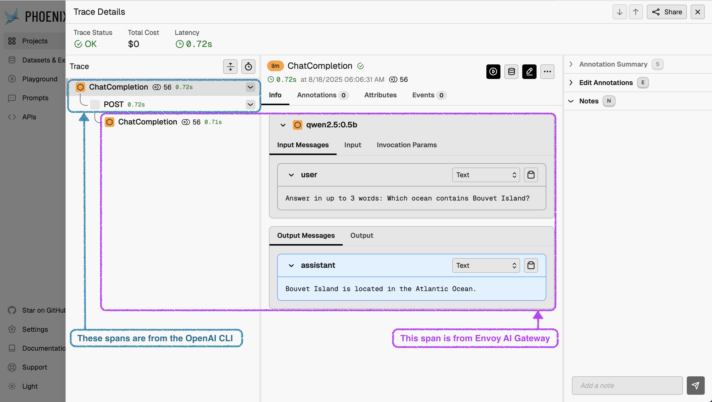

# Envoy AI Gateway CLI (aigw)

## Quick Start

[docker-compose.yml](docker-compose.yaml) builds and runs `aigw`, targeting
[Ollama][ollama] for OpenAI chat completion requests on port 1975.

- **aigw** (port 1975): Envoy AI Gateway CLI (standalone mode)
- **chat-completion**: curl command making a simple chat completion

1. **Start Ollama** on your host machine:

   Start Ollama on all interfaces, with a large context. This allows it to be
   addressable by Docker and handle large tasks, such as from [Goose][goose].
   ```bash
   OLLAMA_CONTEXT_LENGTH=131072 OLLAMA_HOST=0.0.0.0 ollama serve
   ```

2. **Run the example minimal stack**:

   `up` builds `aigw` from source and starts the stack, awaiting health checks.
   ```bash
   docker compose up --wait -d
   ```

3. **Create a simple OpenAI chat completion**:

   The `chat-completion` service uses `curl` to send a simple chat completion
   request to the AI Gateway CLI (aigw) which routes it to Ollama.
   ```bash
   docker compose run --rm chat-completion
   ```

4. **Shutdown the example stack**:

   `down` stops the containers and removes the volumes used by the stack.
   ```bash
   docker compose down -v
   ```

## Quick Start with OpenTelemetry

[docker-compose-otel.yaml](docker-compose-otel.yaml) includes OpenTelemetry
tracing, visualized with [Arize Phoenix][phoenix], an open-source LLM tracing
and evaluation system. It has UX features for LLM spans formatted with
[OpenInference semantics][openinference].

- **aigw** (port 1975): Envoy AI Gateway CLI (standalone mode) with OTEL tracing
- **Phoenix** (port 6006): OpenTelemetry trace viewer UI for LLM observability
- **chat-completion**: OpenAI Python client instrumented with OpenTelemetry

1. **Start Ollama** on your host machine:

   Start Ollama on all interfaces, with a large context. This allows it to be
   addressable by Docker and handle large tasks, such as from [Goose][goose].
   ```bash
   OLLAMA_CONTEXT_LENGTH=131072 OLLAMA_HOST=0.0.0.0 ollama serve
   ```

2. **Run the example OpenTelemetry stack**:

   `up` builds `aigw` from source and starts the stack, awaiting health checks.
   ```bash
   docker compose -f docker-compose-otel.yaml up --wait -d
   ```

3. **Create a simple OpenAI chat completion**:

   `chat-completion` uses the OpenAI Python CLI to send a simple chat completion
   to the AI Gateway CLI (aigw) which routes it to Ollama. Notably, this app
   uses [OpenTelemetry Python][otel-python] to send traces transparently.
   ```bash
   # Invoke the OpenTelemetry instrumented chat completion
   docker compose -f docker-compose-otel.yaml run --build --rm chat-completion

   # Notice the GenAI augmented access logs in the gateway
   docker compose -f docker-compose-otel.yaml logs aigw | grep "genai_model_name"

   # Verify traces are being received by Phoenix
   docker compose -f docker-compose-otel.yaml logs phoenix | grep "POST /v1/traces"
   ```

4. **View traces in Phoenix**:

   Open your browser and navigate to the Phoenix UI to view the traces.
   ```bash
   open http://localhost:6006
   ```

   You should see a trace like this, which shows the OpenAI CLI (Python)
   joining a trace with the Envoy AI Gateway CLI (aigw), showing LLM inputs
   and outputs to the LLM (served by Ollama). The Phoenix screenshot is
   annotated to highlight the key parts of the trace:

   

5. **Shutdown the example stack**:

   `down` stops the containers and removes the volumes used by the stack.
   ```bash
   docker compose -f docker-compose-otel.yaml down -v
   ```

---
[ollama]: https://ollama.com/
[goose]: https://block.github.io/goose/
[openinference]: https://github.com/Arize-ai/openinference/tree/main/spec
[phoenix]: https://docs.arize.com/phoenix
[otel-python]: https://opentelemetry.io/docs/zero-code/python/

