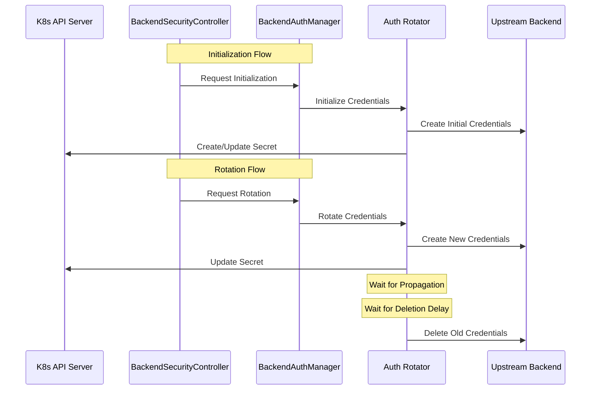

# Backend Authentication Management Design

## Overview

The backend authentication management system in AI Gateway provides a flexible and secure framework for managing authentication credentials to upstream backend services. The system enables the Gateway to securely store, manage, and automatically rotate credentials that it uses to authenticate with upstream backend targets (such as AI model providers, cloud services, etc.).

The system is built around two core packages: `backend_auth_manager` and `backend_auth_rotators`, which together handle credential management, rotation, and security policy enforcement for upstream authentication.

### Key Benefits
- Centralized management of upstream service credentials
- Automatic rotation of credentials to upstream services
- Secure storage and handling of sensitive authentication data
- Zero-downtime credential updates for uninterrupted backend communication
- Support for multiple authentication types to different backend services

## Architecture Components

### Core Components

1. **BackendAuthManager**
   - Central coordinator for upstream authentication management
   - Manages multiple rotator implementations for different backend services
   - Handles registration and dispatching of rotation events
   - Ensures graceful shutdown and cleanup
   - Manages scheduled rotations of upstream credentials
   - Publishes rotation events to subscribers
   - Integrates with Kubernetes events for monitoring

2. **Rotator Interface**
   - Defines the contract for upstream credential rotators
   - Supports initialization and rotation operations
   - Allows for different types of upstream authentication
   - Extensible design for adding new backend service authentication types

3. **BackendSecurityController**
   - Kubernetes controller watching BackendSecurityPolicy resources
   - Triggers rotation events based on policy changes
   - Manages the lifecycle of upstream credential secrets
   - Handles policy reconciliation

### Interaction Flow



## Implementation Details

### BackendAuthManager

The BackendAuthManager (`internal/controller/backend_auth_manager.go`) provides centralized management of upstream service authentication:
- Thread-safe rotator registration for different backend services
- Asynchronous event processing
- Graceful shutdown with cleanup
- Context-aware operation cancellation
- Scheduled rotation management of upstream credentials
- Event publishing for monitoring
- Kubernetes event integration

Key features:
```go
type BackendAuthManager struct {
    rotationChan chan RotationEvent
    rotators     map[RotationType]Rotator
    logger       logr.Logger
    // ... other fields
}
```

### Rotator Interface

The Rotator interface (`internal/controller/backend_auth_rotators/types.go`) defines the contract for all upstream credential rotators:

```go
type Rotator interface {
    Initialize(ctx context.Context, event RotationEvent) error
    Rotate(ctx context.Context, event RotationEvent) error
    Type() RotationType
}
```

### Rotation Events

Rotation events (`internal/controller/backend_auth_rotators/types.go`) carry the necessary information for upstream credential operations:

```go
type RotationEvent struct {
    Namespace string
    Name      string
    Type      RotationType
    Metadata  map[string]string
}
```

## Kubernetes Integration

### Secret Management

- Secure storage of upstream service credentials in Kubernetes secrets
- Support for multiple credential formats based on backend requirements
- Atomic updates using Kubernetes API
- Proper cleanup of old upstream credentials

### BackendSecurityPolicy CRD

```yaml
apiVersion: ai-gateway.envoyproxy.io/v1alpha1
kind: BackendSecurityPolicy
metadata:
  name: example-policy
spec:
  backend:
    credentials:
      secretName: upstream-creds
      type: credential-type  # Type of upstream authentication
      metadata:
        # Backend-specific authentication configuration
        key1: value1
        key2: value2
```

### Controller Reconciliation

1. **Watch Events**
   - Monitors BackendSecurityPolicy changes
   - Detects credential configuration changes
   - Handles policy deletions

2. **Secret Management**
   - Creates/updates secrets as needed
   - Maintains secret ownership
   - Handles cleanup on policy deletion

3. **Error Handling**
   - Retries on transient failures
   - Logs detailed error information
   - Updates policy status with error conditions

## Security Considerations

1. **Credential Lifecycle**
   - Zero-downtime rotation with two-phase process for uninterrupted backend communication
   - Configurable propagation and deletion delays to ensure smooth transition
   - Immediate cleanup on cancellation after minimum propagation
   - Old credentials remain valid during propagation period to prevent service disruption

2. **Access Control**
   - Kubernetes RBAC integration for credential access control
   - Namespace-scoped operations for isolation
   - Least privilege principle for credential management
   - Audit logging support for credential operations

3. **Secret Protection**
   - Secure storage of upstream credentials in Kubernetes secrets
   - Support for secret encryption at rest
   - Atomic updates to prevent race conditions
   - Proper cleanup of old credentials

## Testing Strategy

1. **Unit Tests**
   - Mock backend service APIs
   - Test rotation logic
   - Verify cleanup behavior
   - Test propagation delays
   - Concurrent rotation testing

2. **Integration Tests**
   - Test with Kubernetes API
   - Verify secret updates
   - Check controller reconciliation
   - Test initialization flow

3. **End-to-End Tests**
   - Full rotation cycle
   - Policy changes
   - Error scenarios
   - Scheduled rotations
   - Performance testing

## Performance Considerations

1. **Rotation Timing**
   - Fast initial credential updates
   - Efficient concurrent rotations
   - Scalable to handle multiple concurrent rotations

2. **Resource Management**
   - Proper cleanup of resources
   - Efficient use of goroutines
   - Channel-based event handling
   - Context cancellation support

## Extending the System

To add support for a new authentication type:

1. **Define the Rotator Type**
```go
const (
    RotationTypeNew RotationType = "new-type"
)
```

2. **Implement the Rotator Interface**
```go
type NewRotator struct {
    client    client.Client
    logger    logr.Logger
    // ... other fields
}

func (r *NewRotator) Initialize(ctx context.Context, event RotationEvent) error {
    // Implementation
}

func (r *NewRotator) Rotate(ctx context.Context, event RotationEvent) error {
    // Implementation
}

func (r *NewRotator) Type() RotationType {
    return RotationTypeNew
}
```

3. **Register with BackendAuthManager**
```go
func RegisterNewRotator(bam *BackendAuthManager) error {
    rotator := NewRotator(...)
    return bam.RegisterRotator(rotator)
}
```

## Future Enhancements

1. **Additional Features**
   - Support for more authentication types
   - Enhanced rotation strategies
   - Cross-namespace support
   - Custom rotation windows

2. **Monitoring & Metrics**
   - Detailed rotation metrics
   - Success/failure rates
   - Timing information
   - Health checks
   - Event history

3. **Advanced Capabilities**
   - Dynamic rotation scheduling
   - Batch processing
   - Enhanced error recovery
   - Custom validation rules 
