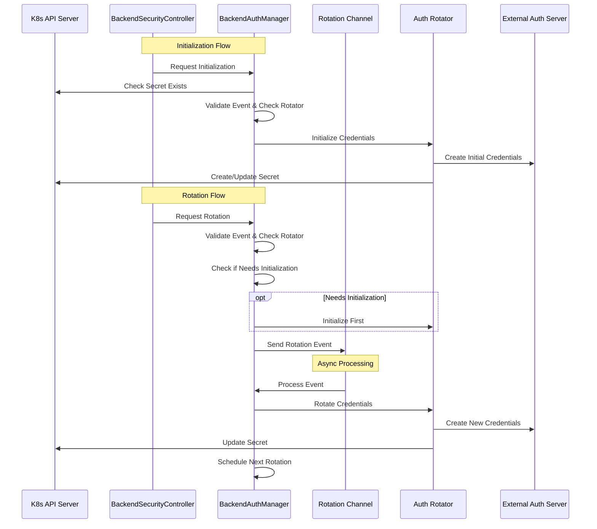

# Backend Authentication Management Design

## Overview

The backend authentication management system in AI Gateway provides a flexible and secure framework for managing authentication credentials to upstream backend services. The system enables the Gateway to securely store, manage, and automatically rotate credentials that it uses to authenticate with upstream backend targets (such as AI model providers, cloud services, etc.).

The system is built around two core packages: `backend_auth_manager` and `backend_auth_rotators`, which together handle credential management, rotation, and security policy enforcement for upstream authentication.

### Key Benefits
- Centralized management of upstream service credentials
- Automatic rotation of credentials to upstream services
- Secure storage and handling of sensitive authentication data
- Zero-downtime credential updates for uninterrupted backend communication
- Support for multiple authentication types to different backend services
- Proactive rotation scheduling before credential expiry

## Architecture Components

### Core Components

1. **BackendAuthManager**
   - Central coordinator for upstream authentication management
   - Manages multiple rotator implementations for different backend services
   - Handles registration and dispatching of rotation events
   - Ensures graceful shutdown and cleanup
   - Manages scheduled rotations of upstream credentials
   - Provides initialization and rotation request handling
   - Supports both immediate and scheduled rotations
   - Maintains thread-safe operation with proper locking mechanisms

2. **Rotation Scheduling**
   - Configurable rotation window (default 5 minutes before expiry)
   - Automatic cancellation of existing scheduled rotations when rescheduling
   - Immediate rotation triggering for past or near-future schedules
   - Context-aware scheduling with proper cleanup
   - Thread-safe tracking of scheduled rotations using sync.Map

3. **Rotator Interface**
   ```go
   type Rotator interface {
       // Initialize performs the initial BackendAuth retrieval
       Initialize(ctx context.Context, event RotationEvent) error
       // Rotate performs the credential rotation
       Rotate(ctx context.Context, event RotationEvent) error
       // Type returns the type of rotator
       Type() RotationType
   }
   ```

4. **Rotation Events**
   ```go
   type RotationEvent struct {
       // Namespace where the rotation should occur
       Namespace string
       // Name of the resource requiring rotation
       Name string
       // Type of rotation to perform
       Type RotationType
       // Metadata contains any additional data needed for rotation
       Metadata map[string]string
   }
   ```

### Supported Rotation Types

Currently implemented rotation types:
```go
const (
    // RotationTypeAWSCredentials represents AWS IAM credentials rotation
    RotationTypeAWSCredentials RotationType = "aws-credentials"
    // RotationTypeAWSOIDC represents AWS OIDC BackendAuth rotation
    RotationTypeAWSOIDC RotationType = "aws-oidc"
)
```

#### AWS IAM Credentials (`aws-credentials`)
This rotator manages long-lived AWS IAM access keys. It is designed for:
- Direct AWS IAM user authentication
- Managing programmatic access keys
- Use cases requiring long-term IAM credentials
- Scenarios where OIDC authentication is not available or suitable

Key features:
- Creates and rotates IAM access key pairs
- Handles proper cleanup of old access keys
- Ensures zero-downtime rotation with propagation delays
- Supports multiple credential profiles

#### AWS OIDC (`aws-oidc`)
This rotator manages temporary credentials obtained through OpenID Connect (OIDC) authentication with AWS. It is designed for:
- Workload identity federation
- Short-lived credential management
- Token exchange with AWS STS service
- Modern cloud-native authentication patterns

Key features:
- Exchanges OIDC tokens for temporary AWS credentials
- Automatic credential refresh before expiration
- Support for role assumption with web identity
- Configurable session duration
- Built-in support for AWS regional endpoints

When choosing between these types:
- Use `aws-credentials` when you need long-lived IAM user credentials
- Use `aws-oidc` when you want to leverage OIDC-based authentication for better security and automated rotation

### Interaction Flow



## Implementation Details

### BackendAuthManager

The BackendAuthManager implements several key operations:

1. **Initialization**
   ```go
   func NewBackendAuthManager(logger logr.Logger, client client.Client) *BackendAuthManager {
       return &BackendAuthManager{
           logger:         logger,
           rotators:       make(map[RotationType]Rotator),
           rotationChan:   make(chan RotationEvent, 100),
           stopChan:       make(chan struct{}),
           client:         client,
           rotationWindow: 5 * time.Minute,
       }
   }
   ```

2. **Rotation Request Handling**
   - Validates rotation events
   - Checks for rotator existence
   - Handles initialization if needed
   - Non-blocking rotation channel sends
   - Proper error handling and logging

3. **Scheduling Management**
   - Thread-safe tracking of scheduled rotations
   - Automatic cleanup of old schedules
   - Context-aware operation for proper cancellation
   - Support for immediate and future rotations

4. **Error Handling**
   - Structured logging with context
   - Proper error wrapping and propagation
   - Graceful failure handling
   - Detailed error messages for debugging

### Rotator Implementation Guidelines

When implementing a new rotator:

1. **Type Definition**
   ```go
   type NewRotator struct {
       client client.Client
       logger logr.Logger
   }
   ```

2. **Required Methods**
   ```go
   // Initialize should handle first-time setup
   func (r *NewRotator) Initialize(ctx context.Context, event RotationEvent) error {
       // Implementation
   }

   // Rotate should handle credential rotation
   func (r *NewRotator) Rotate(ctx context.Context, event RotationEvent) error {
       // Implementation
   }

   // Type should return the rotator type
   func (r *NewRotator) Type() RotationType {
       return RotationTypeNew
   }
   ```

## Security Considerations

1. **Thread Safety**
   - Proper use of mutexes for shared state
   - Thread-safe maps for rotation tracking
   - Atomic operations where needed
   - Proper cleanup on shutdown

2. **Context Management**
   - Context propagation for cancellation
   - Timeout handling
   - Resource cleanup on cancellation
   - Proper goroutine management

3. **Error Handling**
   - Structured logging
   - Error context preservation
   - Proper cleanup on failures
   - Non-blocking operation where appropriate

## Testing Strategy

1. **Unit Tests**
   - Test rotation scheduling
   - Verify thread safety
   - Test error handling
   - Verify context cancellation
   - Test cleanup behavior

2. **Integration Tests**
   - Test with actual rotators
   - Verify scheduling behavior
   - Test concurrent operations
   - Verify cleanup on shutdown

3. **End-to-End Tests**
   - Full rotation lifecycle
   - Scheduling and rescheduling
   - Error recovery
   - Performance under load

## Performance Considerations

1. **Rotation Timing**
   - Fast initial credential updates
   - Efficient concurrent rotations
   - Scalable to handle multiple concurrent rotations

2. **Resource Management**
   - Proper cleanup of resources
   - Efficient use of goroutines
   - Channel-based event handling
   - Context cancellation support

## Extending the System

To add support for a new authentication type:

1. **Define the Rotator Type**
```go
const (
    RotationTypeNew RotationType = "new-type"
)
```

2. **Implement the Rotator Interface**
```go
type NewRotator struct {
    client    client.Client
    logger    logr.Logger
    // ... other fields
}

func (r *NewRotator) Initialize(ctx context.Context, event RotationEvent) error {
    // Implementation
}

func (r *NewRotator) Rotate(ctx context.Context, event RotationEvent) error {
    // Implementation
}

func (r *NewRotator) Type() RotationType {
    return RotationTypeNew
}
```

3. **Register with BackendAuthManager**
```go
func RegisterNewRotator(bam *BackendAuthManager) error {
    rotator := NewRotator(...)
    return bam.RegisterRotator(rotator)
}
```

## Future Enhancements

1. **Additional Features**
   - Support for more authentication types
   - Enhanced rotation strategies
   - Cross-namespace support
   - Custom rotation windows

2. **Monitoring & Metrics**
   - Detailed rotation metrics
   - Success/failure rates
   - Timing information
   - Health checks
   - Event history

3. **Advanced Capabilities**
   - Dynamic rotation scheduling
   - Batch processing
   - Enhanced error recovery
   - Custom validation rules
