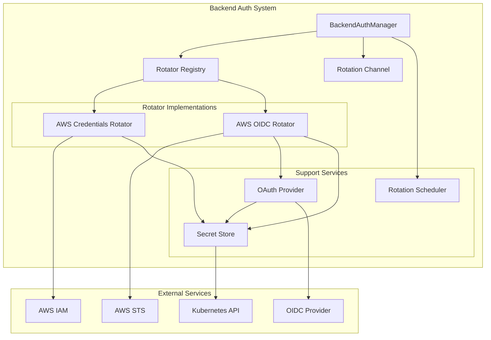
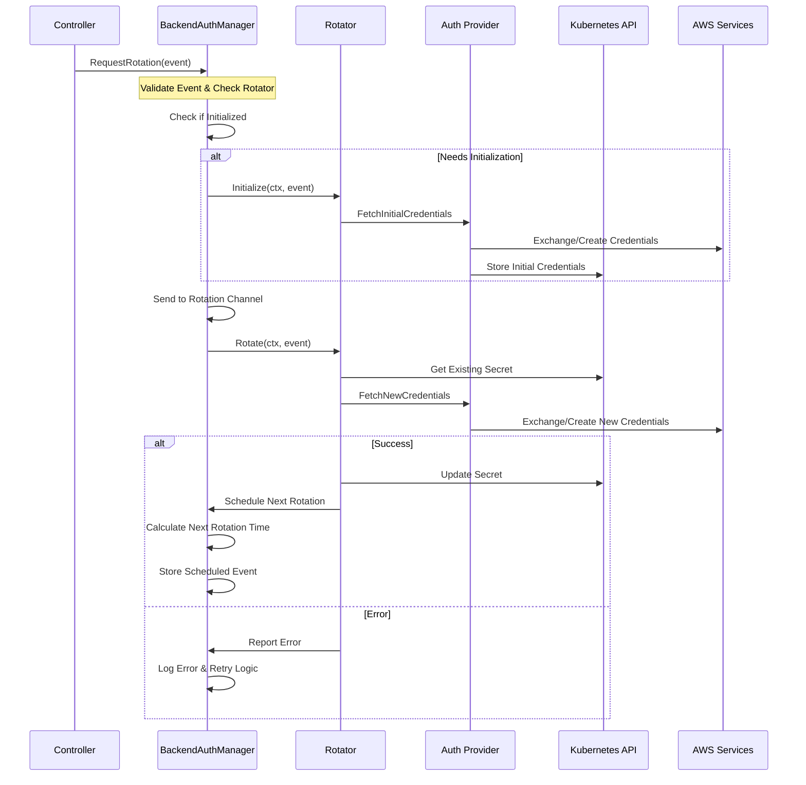

# Backend Authentication Management Design

## Overview

The backend authentication management system in AI Gateway provides a flexible and secure framework for managing authentication credentials to upstream backend services. The system enables secure storage, management, and automatic rotation of credentials used to authenticate with upstream backend targets (such as AI model providers, cloud services, etc.).

## System Architecture

### Core Components

1. **BackendAuthManager**
   - Central coordinator for all authentication operations
   - Manages multiple rotator implementations
   - Handles credential rotation scheduling and execution
   - Ensures thread-safe operations and proper cleanup
   - Provides zero-downtime credential updates

2. **Rotator Interface**
   ```go
   type Rotator interface {
       Initialize(ctx context.Context, event RotationEvent) error
       Rotate(ctx context.Context, event RotationEvent) error
       Type() RotationType
   }
   ```

3. **Rotation Events**
   ```go
   type RotationEvent struct {
       Namespace string
       Name string
       Type RotationType
       Metadata map[string]string
   }
   ```

### Component Interactions



## Key Workflows

### 1. Credential Initialization Flow



### 2. Credential Rotation Process

1. **Scheduling**
   - Configurable rotation window (default 5 minutes before expiry)
   - Automatic cancellation of existing scheduled rotations
   - Thread-safe tracking using sync.Map

2. **Execution**
   - Non-blocking rotation channel processing
   - Proper error handling and logging
   - Zero-downtime updates
   - Cleanup of old credentials

## Authentication Types

### 1. AWS IAM Credentials
- Manages long-lived AWS IAM access keys
- Handles programmatic access keys
- Supports multiple credential profiles
- Ensures proper cleanup of old access keys

### 2. AWS OIDC
- Manages temporary credentials via OIDC authentication
- Supports workload identity federation
- Automatic credential refresh before expiration
- Configurable session duration

## Implementation Details

### BackendAuthManager Implementation

```go
type BackendAuthManager struct {
    rotationChan chan RotationEvent
    rotators     map[RotationType]Rotator
    logger       logr.Logger
    mu           sync.RWMutex
    wg           sync.WaitGroup
    stopChan     chan struct{}
    scheduledRotations sync.Map
    rotationWindow time.Duration
    client       client.Client
}
```

### Thread Safety Mechanisms

1. **Synchronization**
   - Mutex protection for shared state
   - Thread-safe rotation tracking
   - Atomic operations for critical sections

2. **Context Management**
   - Proper context propagation
   - Cancellation support
   - Resource cleanup

## Security Considerations

1. **Credential Management**
   - Secure storage in Kubernetes secrets
   - Zero-downtime credential updates
   - Proper cleanup of old credentials

2. **Error Handling**
   - Structured logging with context
   - Proper error propagation
   - Graceful failure handling

## Extending the System

### Adding New Authentication Types

1. **Define Rotator Type**
   ```go
   const RotationTypeNew RotationType = "new-type"
   ```

2. **Implement Rotator Interface**
   ```go
   type NewRotator struct {
       client    client.Client
       logger    logr.Logger
   }

   func (r *NewRotator) Initialize(ctx context.Context, event RotationEvent) error {
       // Implementation
   }

   func (r *NewRotator) Rotate(ctx context.Context, event RotationEvent) error {
       // Implementation
   }

   func (r *NewRotator) Type() RotationType {
       return RotationTypeNew
   }
   ```

3. **Register with Manager**
   ```go
   func RegisterNewRotator(bam *BackendAuthManager) error {
       rotator := NewRotator(...)
       return bam.RegisterRotator(rotator)
   }
   ```

## Future Enhancements

1. **Feature Expansion**
   - Additional authentication types
   - Enhanced rotation strategies
   - Cross-namespace support

2. **Monitoring & Observability**
   - Detailed rotation metrics
   - Success/failure tracking
   - Health monitoring
   - Event history

3. **Advanced Features**
   - Dynamic rotation scheduling
   - Batch processing
   - Enhanced error recovery
   - Custom validation rules
