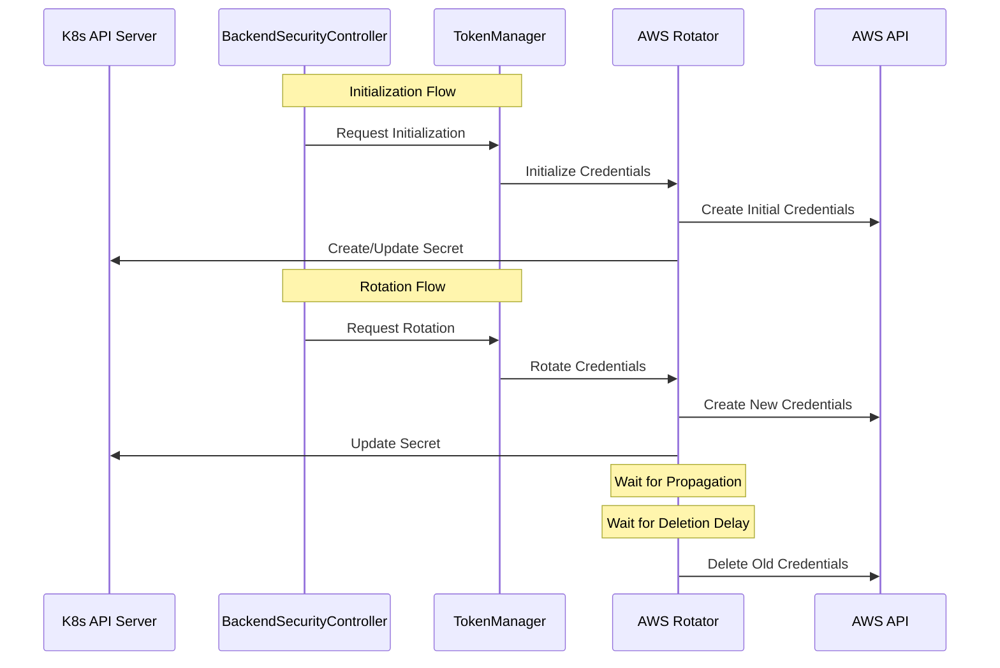

# Credential Rotation Design

## Overview

The credential rotation system in AI Gateway provides automated rotation of AWS credentials, supporting both IAM access keys and OIDC token-based credentials. The system is designed to be extensible, allowing for additional credential types to be added in the future.

## Architecture Components

### Core Components

1. **TokenManager**
   - Central coordinator for credential rotation
   - Manages multiple rotator implementations
   - Handles registration and dispatching of rotation events
   - Ensures graceful shutdown and cleanup
   - Manages scheduled rotations with configurable windows
   - Publishes rotation events to subscribers
   - Integrates with Kubernetes events for monitoring

2. **Rotator Interface**
   - Defines the contract for credential rotators
   - Supports initialization and rotation operations
   - Allows for different types of credential rotation
   - Currently implemented by:
     - `AWSCredentialsRotator` for IAM access keys
     - `AWSOIDCRotator` for OIDC token exchange

3. **BackendSecurityController**
   - Kubernetes controller watching BackendSecurityPolicy resources
   - Triggers rotation events based on policy changes
   - Manages the lifecycle of credential secrets

### Interaction Flow



## Implementation Details

### TokenManager

The TokenManager provides:
- Thread-safe rotator registration
- Asynchronous event processing
- Graceful shutdown with cleanup
- Context-aware operation cancellation
- Scheduled rotation management
- Event publishing for monitoring
- Kubernetes event integration


### Rotator Interface

```go
type Rotator interface {
    Initialize(ctx context.Context, event RotationEvent) error
    Rotate(ctx context.Context, event RotationEvent) error
    Type() RotationType
}
```

### AWS Credentials Rotation

#### IAM Access Key Rotation
1. Creates new access key
2. Updates Kubernetes secret with new credentials
3. Waits for minimum propagation delay
4. Waits for configured deletion delay
5. Deletes old access key

#### OIDC Token Exchange
1. Exchanges OIDC token for temporary AWS credentials
2. Updates Kubernetes secret with new credentials
3. Old credentials expire automatically

## Kubernetes Integration

### Secret Management

- Secrets are stored in Kubernetes secrets
- Format follows AWS credentials file format
- Supports multiple credential profiles
- Updates are atomic using Kubernetes API
- Secrets are created if they don't exist during initialization

### BackendSecurityPolicy CRD

```yaml
apiVersion: ai-gateway.envoyproxy.io/v1alpha1
kind: BackendSecurityPolicy
metadata:
  name: example-policy
spec:
  aws:
    credentials:
      secretName: aws-creds
      type: iam-user  # or oidc
```

### Controller Reconciliation

1. **Watch Events**
   - Monitors BackendSecurityPolicy changes
   - Detects credential configuration changes
   - Handles policy deletions

2. **Secret Management**
   - Creates/updates secrets as needed
   - Maintains secret ownership
   - Handles cleanup on policy deletion

3. **Error Handling**
   - Retries on transient failures
   - Logs detailed error information
   - Updates policy status with error conditions

## Security Considerations

1. **Credential Lifecycle**
   - Two-phase rotation with propagation and deletion delays
   - Minimum propagation delay ensures new credentials are active
   - Configurable deletion delay for graceful transition
   - Immediate cleanup on cancellation after minimum propagation
   - Old credentials remain valid during propagation period

2. **Access Control**
   - Uses Kubernetes RBAC
   - Separate permissions for different operations
   - Least privilege principle

3. **Secret Protection**
   - Secrets are never logged
   - Atomic updates prevent race conditions
   - Proper cleanup of old credentials
   - Support for multiple credential profiles

## Testing Strategy

1. **Unit Tests**
   - Mock AWS APIs
   - Test rotation logic
   - Verify cleanup behavior
   - Test propagation delays

2. **Integration Tests**
   - Test with Kubernetes API
   - Verify secret updates
   - Check controller reconciliation
   - Test initialization flow

3. **End-to-End Tests**
   - Full rotation cycle
   - Policy changes
   - Error scenarios
   - Scheduled rotations

## Extensibility Example: OAuth 2.0 Client Credentials Rotator

This section demonstrates the system's extensibility by showing how to implement a standard OAuth 2.0 Client Credentials rotator.

### Implementation Overview

```go
// OAuth2Rotator implements the Rotator interface for OAuth 2.0 Client Credentials
type OAuth2Rotator struct {
    k8sClient    client.Client
    logger       logr.Logger
    httpClient   *http.Client
    // Configurable delays for token refresh
    refreshWindow time.Duration
}

// RotationEvent metadata keys
const (
    TokenEndpointKey     = "token_endpoint"
    ClientIDKey         = "client_id"
    ClientSecretKey     = "client_secret"
    ScopeKey           = "scope"
)

// Type implements the Rotator interface
func (r *OAuth2Rotator) Type() RotationType {
    return RotationTypeOAuth2ClientCredentials
}
```

### Initialization Flow

```go
// Initialize implements the Rotator interface
func (r *OAuth2Rotator) Initialize(ctx context.Context, event RotationEvent) error {
    // 1. Validate required metadata
    if err := r.validateMetadata(event.Metadata); err != nil {
        return err
    }

    // 2. Request initial access token
    token, err := r.requestNewToken(ctx, event.Metadata)
    if err != nil {
        return fmt.Errorf("failed to request initial token: %w", err)
    }

    // 3. Create or update the secret
    secret := &corev1.Secret{
        ObjectMeta: metav1.ObjectMeta{
            Name:      event.Name,
            Namespace: event.Namespace,
        },
        Data: map[string][]byte{
            "access_token":  []byte(token.AccessToken),
            "token_type":    []byte(token.TokenType),
            "expires_at":    []byte(token.ExpiresAt.Format(time.RFC3339)),
        },
    }

    return r.k8sClient.Create(ctx, secret)
}
```

### Rotation Flow

```go
// Rotate implements the Rotator interface
func (r *OAuth2Rotator) Rotate(ctx context.Context, event RotationEvent) error {
    // 1. Get existing secret
    var secret corev1.Secret
    if err := r.k8sClient.Get(ctx, client.ObjectKey{
        Namespace: event.Namespace,
        Name:      event.Name,
    }, &secret); err != nil {
        return err
    }

    // 2. Request new token
    token, err := r.requestNewToken(ctx, event.Metadata)
    if err != nil {
        return fmt.Errorf("failed to request new token: %w", err)
    }

    // 3. Update secret with new token
    secret.Data["access_token"] = []byte(token.AccessToken)
    secret.Data["token_type"] = []byte(token.TokenType)
    secret.Data["expires_at"] = []byte(token.ExpiresAt.Format(time.RFC3339))

    return r.k8sClient.Update(ctx, &secret)
}
```

### BackendSecurityPolicy Integration

```yaml
apiVersion: ai-gateway.envoyproxy.io/v1alpha1
kind: BackendSecurityPolicy
metadata:
  name: oauth2-example
spec:
  oauth2:
    credentials:
      secretName: oauth2-creds
      type: client-credentials
      metadata:
        token_endpoint: "https://auth.example.com/oauth/token"
        client_id: "${CLIENT_ID}"
        client_secret: "${CLIENT_SECRET}"
        scope: "api:access"
```

### Key Implementation Aspects

1. **Token Management**
   - Automatic refresh before expiration
   - Configurable refresh window
   - Support for different token types and scopes

2. **Error Handling**
   - Retry logic for token requests
   - Rate limiting compliance
   - HTTP status code specific handling

3. **Security**
   - TLS verification
   - Client secret protection
   - Token secure storage

4. **Monitoring**
   - Token expiration tracking
   - Refresh attempt metrics
   - Error rate monitoring

### Integration Steps

1. **Register the Rotator**
```go
func RegisterOAuth2Rotator(tm *TokenManager) error {
    rotator, err := NewOAuth2Rotator(
        tm.k8sClient,
        tm.logger.WithName("oauth2-rotator"),
    )
    if err != nil {
        return err
    }
    return tm.RegisterRotator(rotator)
}
```

2. **Configure Controller**
```go
func (c *Controller) SetupWithManager(mgr ctrl.Manager) error {
    // Register OAuth2 rotator
    if err := RegisterOAuth2Rotator(c.tokenManager); err != nil {
        return err
    }
    
    return ctrl.NewControllerManagedBy(mgr).
        For(&v1alpha1.BackendSecurityPolicy{}).
        Complete(c)
}
```

This example demonstrates how the credential rotation system can be extended to support new authentication mechanisms while maintaining consistent behavior and security practices.

## Future Enhancements

1. **Additional Credential Types**
   - Support for other cloud providers
   - Custom credential rotators
   - Enhanced rotation strategies

2. **Monitoring & Metrics**
   - Rotation success/failure metrics
   - Timing information
   - Health checks
   - Event history

3. **Advanced Features**
   - Scheduled rotations
   - Batch processing
   - Cross-namespace support
   - Custom rotation windows
