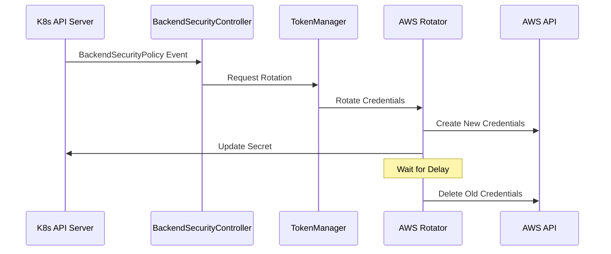

# Credential Rotation Design

## Overview

The credential rotation system in AI Gateway provides automated rotation of AWS credentials, supporting both IAM access keys and OIDC token-based credentials. The system is designed to be extensible, allowing for additional credential types to be added in the future.

## Architecture Components

### Core Components

1. **TokenManager**
   - Central coordinator for credential rotation
   - Manages multiple rotator implementations
   - Handles registration and dispatching of rotation events
   - Ensures graceful shutdown and cleanup

2. **Rotator Interface**
   - Defines the contract for credential rotators
   - Allows for different types of credential rotation
   - Currently implemented by:
     - `AWSCredentialsRotator` for IAM access keys
     - `AWSOIDCRotator` for OIDC token exchange

3. **BackendSecurityController**
   - Kubernetes controller watching BackendSecurityPolicy resources
   - Triggers rotation events based on policy changes
   - Manages the lifecycle of credential secrets

### Interaction Flow



## Implementation Details

### TokenManager

The TokenManager provides:
- Thread-safe rotator registration
- Asynchronous event processing
- Graceful shutdown with cleanup
- Context-aware operation cancellation

```go
type TokenManager struct {
    rotationChan chan RotationEvent
    rotators     map[RotationType]Rotator
    logger       logr.Logger
    mu           sync.RWMutex
    wg           sync.WaitGroup
    stopChan     chan struct{}
}
```

### Rotator Interface

```go
type Rotator interface {
    Rotate(ctx context.Context, event RotationEvent) error
    GetType() RotationType
}
```

### AWS Credentials Rotation

#### IAM Access Key Rotation
1. Creates new access key
2. Updates Kubernetes secret with new credentials
3. Waits for configured delay
4. Deletes old access key

#### OIDC Token Exchange
1. Exchanges OIDC token for temporary AWS credentials
2. Updates Kubernetes secret with new credentials
3. Old credentials expire automatically

## Kubernetes Integration

### Secret Management

- Secrets are stored in Kubernetes secrets
- Format follows AWS credentials file format
- Supports multiple credential profiles
- Updates are atomic using Kubernetes API

### BackendSecurityPolicy CRD

```yaml
apiVersion: ai-gateway.envoyproxy.io/v1alpha1
kind: BackendSecurityPolicy
metadata:
  name: example-policy
spec:
  aws:
    credentials:
      secretName: aws-creds
      type: iam-user  # or oidc
```

### Controller Reconciliation

1. **Watch Events**
   - Monitors BackendSecurityPolicy changes
   - Detects credential configuration changes
   - Handles policy deletions

2. **Secret Management**
   - Creates/updates secrets as needed
   - Maintains secret ownership
   - Handles cleanup on policy deletion

3. **Error Handling**
   - Retries on transient failures
   - Logs detailed error information
   - Updates policy status with error conditions

## Security Considerations

1. **Credential Lifecycle**
   - Old credentials remain valid during rotation
   - Configurable delay before deletion
   - Immediate cleanup on cancellation

2. **Access Control**
   - Uses Kubernetes RBAC
   - Separate permissions for different operations
   - Least privilege principle

3. **Secret Protection**
   - Secrets are never logged
   - Atomic updates prevent race conditions
   - Proper cleanup of old credentials

## Testing Strategy

1. **Unit Tests**
   - Mock AWS APIs
   - Test rotation logic
   - Verify cleanup behavior

2. **Integration Tests**
   - Test with Kubernetes API
   - Verify secret updates
   - Check controller reconciliation

3. **End-to-End Tests**
   - Full rotation cycle
   - Policy changes
   - Error scenarios

## Future Enhancements

1. **Additional Credential Types**
   - Support for other cloud providers
   - Custom credential rotators
   - Enhanced rotation strategies

2. **Monitoring & Metrics**
   - Rotation success/failure metrics
   - Timing information
   - Health checks

3. **Advanced Features**
   - Scheduled rotations
   - Batch processing
   - Cross-namespace support 
