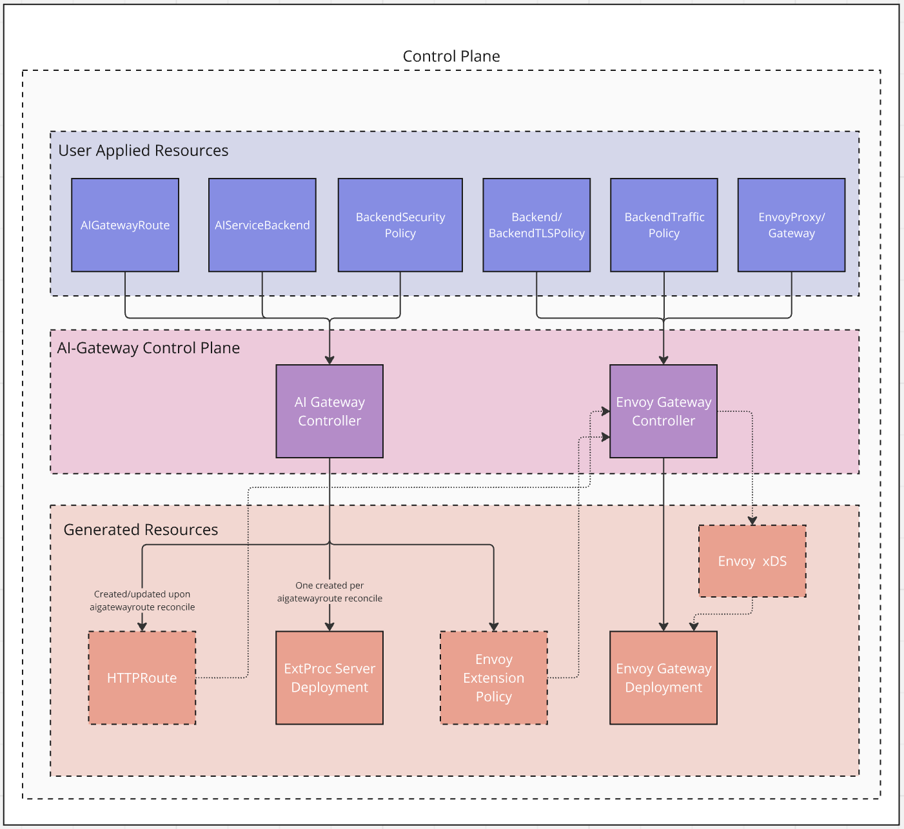
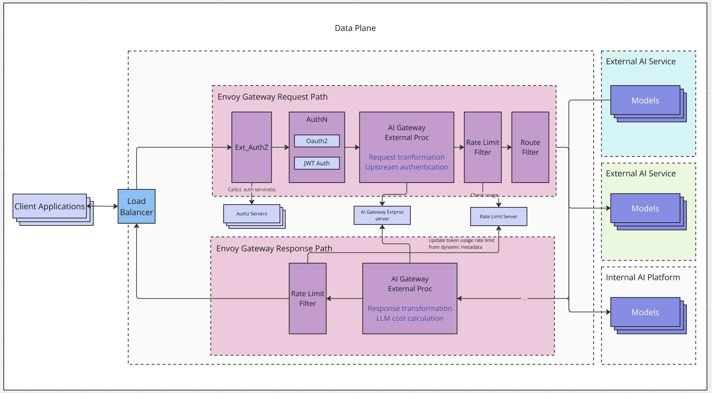

# Envoy AI Gateway

## Proposal Status
 ***Draft***

## Table of Contents

<!-- toc -->

-   [Summary](#summary)
-   [Goals](#goals)
-   [Non-Goals](#non-goals)
-   [Proposal](#proposal)
    -   [Personas](#personas)
        -   [Inference Platform Admin](#inference-platform-admin)
    -   [Axioms](#axioms)
    -   [LLMRoute](#llmroute)
    -   [LLMBackend](#llmbackend)
    -   [Spec](#spec)
    -   [Diagrams](#diagrams)
    -   [Alternatives](#alternatives)
- [FAQ](#faq)
- [Open Questions](#open-questions)

<!-- /toc -->

## Summary

This proposal introduces four new Custom Resource Definitions(CRD) to support the requirements of the Envoy AI Gateway: **LLMRoute**, **LLMBackend** and **LLMTrafficPolicy**.

* The `LLMRoute` specifies the schema for the user requests and routing rules associated with a list of `LLMBackend`.
* The `LLMBackend` defines the request schema for various LLM providers. This resource is managed by the Inference Platform Admin persona.
* The `LLMTrafficPolicy` defines the traffic management policies, including rate limiting for token usage.
* The `LLMProviderPolicy` defines the authentication policy for LLM provider using the API token or OIDC federation.

## Goals

- Drive the consensus on the Envoy AI Gateway API for the MVP features
- Documentation of API decisions for posterity

## Non-Goals

- non-MVP features
- Routing for LLM serving instances in a Kubernetes cluster

## Proposal

### Personas

Before diving into the details of the API, descriptions of the personas will help shape the thought process of the API design.

#### Inference Platform Admin

The Inference Platform Admin manages the gateway infrastructure necessary to route inference requests to a variety of LLM providers. Including handling Ops for:
  - A list of LLM providers and supported models
  - LLM provider API schema conversion and centralized upstream authentication configurations.
  - Traffic policy including rate limiting, fallback resilience between providers.

#### Payment Team

- Reports the per user/tenant LLM token usage for billing purpose.

### Axioms

The API design is based on these axioms:

- This solution should be composable with other Gateway solutions.
- Gateway architecture should be extensible when customization is required.
- The MVP heavily assumes that the requests are done using the OpenAI spec, but open to the extension in the future.


### LLMRoute

`LLMRoute` defines the unified user request schema and the routing rules to a list of supported `LLMBackend`s.

- LLMRoute serves as a way to define the unified AI Gateway API which allows downstream clients to use a single schema API to interact with multiple `LLMBackend`s.
- The `HTTPRoute` spec is embed to allow defining the routing rules based on HTTP routing headers which can either be sent by user or determined by the ai gateway.

#### Spec

```golang
// LLMRouteSpec details the LLMRoute configuration.
type LLMRouteSpec struct {
// APISchema specifies the API schema of the input that the target Gateway(s) will receive.
// Based on this schema, the ai-gateway will perform the necessary transformation to the
// output schema specified in the selected LLMBackend during the routing process.
//
// Currently, the only supported schema is OpenAI as the input schema.
//
// +kubebuilder:validation:Required
// +kubebuilder:validation:XValidation:rule="self.schema == 'OpenAI'"
APISchema LLMAPISchema `json:"inputSchema"`
// Rules is the list of LLMRouteRule that this LLMRoute will match the traffic to.
// Each rule is a subset of the HTTPRoute in the Gateway API (https://gateway-api.sigs.k8s.io/api-types/httproute/).
//
// AI Gateway controller will generate a HTTPRoute based on the configuration given here with the additional
// modifications to achieve the necessary jobs, notably inserting the AI Gateway external processor filter.
//
// In the matching conditions in the LLMRouteRule, `x-envoy-ai-gateway-llm-model` header
// can be used to describe the routing behavior in the HTTPRoute.
//
// +kubebuilder:validation:Required
// +kubebuilder:validation:MaxItems=128
Rules []LLMRouteRule `json:"rules"`
}

// LLMRouteRule is a rule that defines the routing behavior of the LLMRoute.
type LLMRouteRule struct {
// BackendRefs is the list of LLMBackend that this rule will route the traffic to.
// Each backend can have a weight that determines the traffic distribution.
//
// The namespace of each backend is "local", i.e. the same namespace as the LLMRoute.
//
// +optional
// +kubebuilder:validation:MaxItems=128
BackendRefs []LLMRouteRuleBackendRef `json:"backendRefs,omitempty"`

// Matches is the list of LLMRouteMatch that this rule will match the traffic to.
// This is a subset of the HTTPRouteMatch in the Gateway API. See for the details:
// https://gateway-api.sigs.k8s.io/reference/spec/#gateway.networking.k8s.io%2fv1.HTTPRouteMatch
//
// +optional
// +kubebuilder:validation:MaxItems=128
Matches []LLMRouteRuleMatch `json:"matches,omitempty"`
}
```


### LLMBackend

`LLMBackend` defines the LLM provider API schema and a reference to the envoy gateway backend

- The Gateway routes the traffic to the appropriate `LLMBackend` by converting the unified API schema to the LLM provider API schema.
- The LLMBackend is attached with the upstream provider security policy and traffic policies to perform other necessary jobs for upstream authentication and rate limiting.

```golang
// LLMBackendSpec details the LLMBackend configuration.
type LLMBackendSpec struct {
// APISchema specifies the API schema of the output format of requests from
// Envoy that this LLMBackend can accept as incoming requests.
// Based on this schema, the ai-gateway will perform the necessary transformation for
// the pair of LLMRouteSpec.APISchema and LLMBackendSpec.APISchema.
//
// This is required to be set.
//
// +kubebuilder:validation:Required
APISchema LLMAPISchema `json:"outputSchema"`
// BackendRef is the reference to the Backend resource that this LLMBackend corresponds to.
//
// A backend can be of either k8s Service or Backend resource of Envoy Gateway.
//
// This is required to be set.
//
// +kubebuilder:validation:Required
BackendRef egv1a1.BackendRef `json:"backendRef"`
}
```

### LLMSecurityPolicy

```golang
// LLMSecurityPolicySpec specifies a provider (e.g.AWS Bedrock, Azure etc.) specific-configuration like auth
type LLMSecurityPolicySpec struct {
// Type specifies the type of the provider. Currently, only "APIKey" and "AWS_IAM" are supported.
//
// +kubebuilder:validation:Enum=APIKey;AWS_IAM
Type AuthenticationType `json:"type"`

// APIKey specific configuration. The API key will be injected into the Authorization header.
// +optional
APIKey *LLMProviderAPIKey `json:"apiKey,omitempty"`
}
```

### LLMTrafficPolicy

`LLMTrafficPolicy` defines the rate limiting rules to track the token usage, the token usage can be specified at the per-model, per-user or `user-model` combinations.


```go
// LLMBackendTrafficPolicy controls the flow of traffic to the backend.
type LLMBackendTrafficPolicy struct {
	metav1.TypeMeta   `json:",inline"`
	metav1.ObjectMeta `json:"metadata,omitempty"`
	// Spec defines the details of the LLMBackend traffic policy.
	Spec LLMBackendTrafficPolicySpec `json:"spec,omitempty"`
}

// LLMBackendTrafficPolicySpec defines the details of llm backend traffic policy
// like rateLimit, timeout etc.
type LLMBackendTrafficPolicySpec struct {
    // BackendRefs lists the LLMBackends that this traffic policy will apply
    // The namespace is "local", i.e. the same namespace as the LLMRoute.
    //
    BackendRef LLMBackendLocalRef `json:"backendRef,omitempty"`
    // RateLimit defines the rate limit policy.
    RateLimit *LLMTrafficPolicyRateLimit `json:"rateLimit,omitempty"`
}
```

```go
type LLMTrafficPolicyRateLimit struct {
    // Rules defines the rate limit rules.
    Rules []LLMTrafficPolicyRateLimitRule `json:"rules,omitempty"`
}

// LLMTrafficPolicyRateLimitRule defines the details of the rate limit policy.
type LLMTrafficPolicyRateLimitRule struct {
// Headers is a list of request headers to match. Multiple header values are ANDed together,
// meaning, a request MUST match all the specified headers.
// At least one of headers or sourceCIDR condition must be specified.
Headers []LLMPolicyRateLimitHeaderMatch `json:"headers,omitempty"`
// +kubebuilder:validation:MinItems=1
Limits []LLMPolicyRateLimitValue `json:"limits"`
}
```

### Yaml Examples

#### LLMRoutes(s)
`LLMRoute` embeds the `HTTPRoute` spec and users can configure the routing rules in a standardized way via `HTTPRoute` while
leveraging the LLM specific information e.g `x-envoy-ai-gateway-llm-model` HTTP header. The routing calculation in the `ExtProc`
is done by analyzing the match rules on `HTTPRoute` spec to emulate the behavior in order to perform the request/response transformation,
because the routing decision is made at the very end of the filter chain.

```yaml
apiVersion: aigateway.envoyproxy.io/v1alpha1
kind: LLMRoute
metadata:
  name: llama-3-route
spec:
  inputSchema: OpenAI
  httpRoute:
    matches:
      - headers:
          key: x-envoy-ai-gateway-llm-model
          value: llama3-70b
        backendRefs:
        - name: kserve-backend
          weight: 20
        - name: aws-bedrock-backend
          weight: 80
```

`LLMBackend`
```yaml
apiVersion: aigateway.envoyproxy.io/v1alpha1
kind: LLMBackend
metadata:
  name: kserve
spec:
  outputSchema: OpenAI
  backendRef: kserve-backend
  trafficPolicy: llama-ratelimit
---
apiVersion: aigateway.envoyproxy.io/v1alpha1
kind: LLMBackend
metadata:
  name: aws-bedrock-llama-3
spec:
  outputSchema: AWSBedrock
  backendRef: aws-bedrock-backend
  trafficPolicy: claude-ratelimit
```

#### LLMTrafficPolicy

```yaml
apiVersion: aigateway.envoyproxy.io/v1alpha1
kind: LLMTrafficPolicy
metadata:
  name: llama-ratelimit
spec:
  rateLimit:
    rules:
      - headers:
          - name: x-ai-gateway-llm-model-name
            type: exact
            value: llama-3.3-70b-instruction
          - name: x-user-id
            type: Distinct
        limits:
          - type: token
            quantity: 10
            tokenUsageExpression:
              expr: "$response_body.usage.total_tokens | tonumber"
```

### Control Plane
Envoy AI Gateway extends Envoy Gateway using an Extension Server. Envoy Gateway can be configured to call an external server over gRPC with
the xDS configuration before it is sent to Envoy Proxy. The Envoy Gateway extension Server provides a mechanism where Envoy Gateway tracks
custom resources and then calls a set of hooks that allow the generated xDS configuration to be modified before it is sent to Envoy Proxy.



AI Gateway ExtProc controller watches the `LLMRoute` resource and perform the follow steps:
- Reconciles the envoy gateway ext proc deployment and creates the extension policy.
- Reconciles the envoy proxy deployment and attach the AWS credential if the provider is AWS.
- Reconciles `LLMRoute` to configure the routing rules via `HTTPRoute` spec.

When envoy gateway starts it builds the HTTP filter chain:
- Rate limit filter
- AWS signing filter
- AI Gateway ExtProc filter

### Data Plane

Much of this is better explained visually:

Below is a detailed view how an inference request works on envoy AI gateway



This diagram lightly follows the example request for routing to Anthropic claude 3.5 sonnet model on AWS Bedrock.
The flow can be described as:
- The request comes in to envoy AI gateway(Ext-Proc)
- Ext Authorization filter is applied for checking if the user or account is authorized to access the model
- ExtProc looks up the model name claude-3.5-sonnet from the request and inject the request header `x-ai-gateway-llm-model-name`
- ExtProc extracts the request header for the LLM backend `x-ai-gateway-llm-backend`
- ExtProc translates the user inference request (OpenAI) to the data schema according to the LLM provider
- ExtProc injects the API key or refreshes the AWS credential for upstream provider authentication
- Rate limiting is applied for request based usage tracking
- AWS signing filter is applied for authenticating with AWS Bedrock service if the backend is targeted to AWS
- Routing rule is applied to route the request to the specified or calculated destination.


## FAQ


## Open Questions

