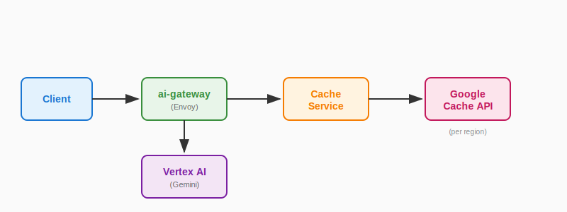
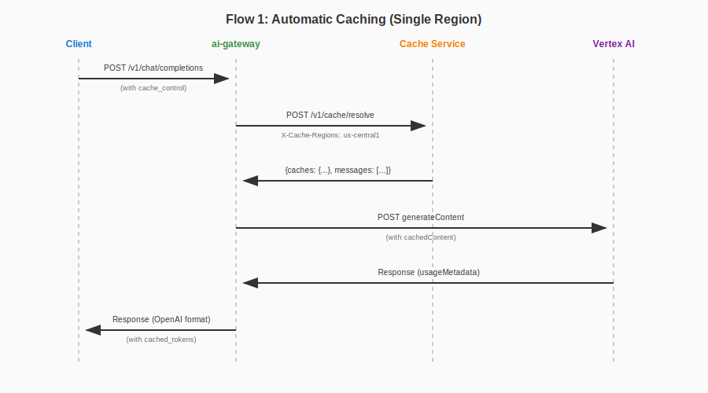
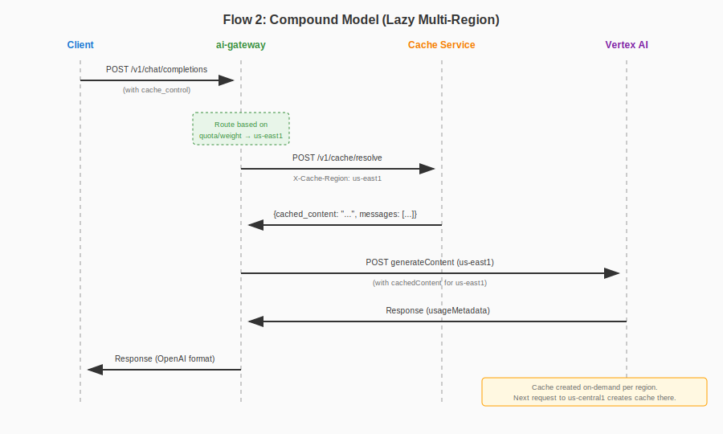
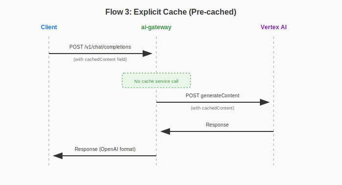

# Context Caching Support for GCP Vertex AI

## Table of Contents

<!-- toc -->

- [Summary](#summary)
- [Background](#background)
- [Architecture](#architecture)
- [Schema Extensions](#schema-extensions)
- [Cache Service API](#cache-service-api)
- [Request Flow](#request-flow)
- [Multi-Region Caching](#multi-region-caching)
- [Token Metrics](#token-metrics)
- [Error Handling](#error-handling)
- [Manual Cache Warming](#manual-cache-warming)
- [Future Enhancements](#future-enhancements)

<!-- /toc -->

## Summary

This proposal introduces context caching support for GCP Vertex AI (Gemini) in the Envoy AI Gateway. Context caching allows users to cache large, frequently-used content (system prompts, documents, few-shot examples) to reduce costs and latency on subsequent requests.

The implementation introduces:
1. A new external cache service that manages Google's `cachedContents` API
2. Schema extensions to support cache markers on messages and explicit cache names
3. Integration with the existing ai-gateway translation pipeline
4. Multi-region cache support for compound models

## Background

GCP Vertex AI provides a [Context Caching API](https://cloud.google.com/vertex-ai/docs/context-cache/context-cache-overview) that allows caching input tokens for reuse across multiple requests. Cached tokens are billed at a reduced rate (~25% of standard input token price), making this valuable for:

- Large system prompts
- Few-shot examples
- Retrieved documents (RAG)
- Long conversation prefixes

**Constraints:**
- Cached content must be a contiguous block of messages
- Cached content always appears as a prefix (before non-cached messages)
- Minimum token threshold applies (varies by model, see [GCP documentation](https://cloud.google.com/vertex-ai/docs/context-cache/context-cache-overview) for model-specific limits)
- Cache has a TTL (default 1 hour, configurable)
- **Cache is regional** - a cache created in `us-central1` cannot be used from `us-east1`

## Architecture



**Components:**

1. **ai-gateway (Envoy)**: Receives OpenAI-format requests, detects cache markers, calls cache service with region list from compound model config, translates to Gemini format with `cachedContent` field.

2. **Cache Service**: External HTTP microservice that:
   - Receives messages marked for caching and target regions
   - Generates a deterministic cache key from content
   - Checks if cache exists in each region (via Google API)
   - Creates cache in regions where it doesn't exist (in parallel)
   - Returns region-to-cache-name mapping and filtered messages

## Schema Extensions

### Request: Cache Control on Messages

Reuse the existing `cache_control` field on message content items (Anthropic-style):

```json
{
  "model": "gemini-1.5-pro",
  "messages": [
    {
      "role": "system",
      "content": [
        {
          "type": "text",
          "text": "You are a helpful assistant with extensive knowledge...",
          "cache_control": {
            "type": "ephemeral",
            "ttl": "3600s"
          }
        }
      ]
    },
    {
      "role": "user",
      "content": "What is quantum computing?"
    }
  ]
}
```

**Cache Control Fields:**
| Field | Type | Description |
|-------|------|-------------|
| `type` | string | Must be `"ephemeral"` |
| `ttl` | string | Optional. Cache TTL in seconds format (e.g., `"3600s"`). Defaults to 1 hour. |

**Rules:**
- Only the first contiguous block of messages with `cache_control` is cached
- Non-contiguous cache markers are ignored (messages after a gap are not cached)
- All messages in the cached block are sent to cache service; remaining messages are sent to Gemini with the cache reference

**Example: Non-contiguous markers**

```json
{
  "messages": [
    {"role": "system", "content": [{"type": "text", "text": "...", "cache_control": {"type": "ephemeral"}}]},
    {"role": "user", "content": [{"type": "text", "text": "...", "cache_control": {"type": "ephemeral"}}]},
    {"role": "assistant", "content": "..."},
    {"role": "user", "content": [{"type": "text", "text": "...", "cache_control": {"type": "ephemeral"}}]},
    {"role": "user", "content": "Latest question"}
  ]
}
```

Result:
- Messages 0-1 are cached (contiguous block)
- Message 2 breaks the chain (no `cache_control`)
- Message 3's `cache_control` is **ignored** (after gap)
- Messages 2-4 are sent as non-cached content

### Request: Explicit Cache Name (Pre-cached Content)

Extend `GCPVertexAIVendorFields` to support explicit cache names for pre-cached content:

```go
type GCPVertexAIVendorFields struct {
    // ...existing fields...

    // CachedContent specifies a pre-existing cache to use.
    // Format: "projects/{project}/locations/{location}/cachedContents/{cache_id}"
    //
    // When provided, cache markers on messages are ignored and the cache service
    // is not called. The request is sent directly to Gemini with this cache reference.
    CachedContent string `json:"cachedContent,omitzero"`
}
```

**Example:**

```json
{
  "model": "gemini-1.5-pro",
  "messages": [
    {
      "role": "user",
      "content": "Summarize the document."
    }
  ],
  "cachedContent": "projects/my-project/locations/us-central1/cachedContents/abc123"
}
```

### Validation

ai-gateway returns `400 Bad Request` if both cache markers and explicit `cachedContent` are present:

```json
{
  "error": {
    "message": "Cannot specify both cache_control on messages and explicit cachedContent field",
    "type": "invalid_request_error",
    "code": "invalid_cache_config"
  }
}
```

## Cache Service API

### Endpoint

```
POST /v1/cache/resolve
```

### Authentication

The cache service requires:
- **Inbound**: Reuse JWT token from the OpenAI request (passed through by ai-gateway)
- **Outbound**: GCP credentials to call Google's `cachedContents` API

### Request

**Headers:**
| Header | Required | Description |
|--------|----------|-------------|
| `X-Cache-Regions` | No | Comma-separated list of regions (e.g., `us-central1,us-east1`). If omitted, cache service resolves automatically. |

**Body:**

The request body is the OpenAI-format request, passed through from ai-gateway:

```json
{
  "model": "gemini-1.5-pro",
  "messages": [
    {
      "role": "system",
      "content": [
        {
          "type": "text",
          "text": "You are a helpful assistant...",
          "cache_control": {"type": "ephemeral", "ttl": "3600s"}
        }
      ]
    },
    {
      "role": "user",
      "content": [
        {
          "type": "text",
          "text": "Context document: ...",
          "cache_control": {"type": "ephemeral"}
        }
      ]
    },
    {
      "role": "user",
      "content": "What is the summary?"
    }
  ],
  "tools": [...]
}
```

**Body Fields:**
| Field | Type | Required | Description |
|-------|------|----------|-------------|
| `model` | string | Yes | Model name (e.g., `"gemini-1.5-pro"`) |
| `messages` | array | Yes | OpenAI-format messages with cache markers |
| `tools` | array | No | Tools to include in cache (if present). Gemini supports caching tool definitions. |

### Response

```json
{
  "caches": {
    "us-central1": "projects/.../locations/us-central1/cachedContents/abc123",
    "us-east1": "projects/.../locations/us-east1/cachedContents/xyz789"
  },
  "messages": [
    {
      "role": "user",
      "content": "What is the summary?"
    }
  ],
  "cache_metadata": {
    "cache_key": "a1b2c3d4e5f6...",
    "created_regions": ["us-east1"],
    "existing_regions": ["us-central1"],
    "token_count": 32768,
    "expire_time": "2024-01-15T11:00:00Z"
  }
}
```

**Response Fields:**
| Field | Type | Description |
|-------|------|-------------|
| `caches` | object | Map of region → Google cache resource name |
| `messages` | array | Filtered messages (non-cached portion only) |
| `cache_metadata.cache_key` | string | Deterministic key generated from content |
| `cache_metadata.created_regions` | array | Regions where cache was newly created |
| `cache_metadata.existing_regions` | array | Regions where cache already existed |
| `cache_metadata.token_count` | integer | Number of tokens in the cached content |
| `cache_metadata.expire_time` | string | Cache expiration timestamp (RFC 3339) |

### Cache Lookup Strategy

The cache service checks for existing caches by:
1. Listing caches from Google's `cachedContents` API (per region)
2. Matching by `displayName` (which stores the generated cache key)

Google's list endpoint only returns non-expired caches, ensuring accuracy.

**Note**: For multi-node deployments, a shared store (e.g., Redis) may be used to coordinate cache state across instances. Implementation details are outside the scope of this proposal.

### Cache Service Internal Flow

```
1. Extract cached messages (first contiguous block with cache_control)
2. Generate cache key from: hash(messages + tools)
3. For each region (in parallel):
   a. List caches from Google API
   b. Search for matching displayName
   c. If found: add to existing_regions
   d. If not found: create cache, add to created_regions
4. Return caches map + filtered messages + metadata
```

## Request Flow

### Flow 1: Automatic Caching (Cache Markers) - Single Region



### Flow 2: Automatic Caching - Multi-Region (Compound Model)



### Flow 3: Explicit Cache (Pre-cached)



## Multi-Region Caching

### Overview

When ai-gateway is configured with compound models that span multiple regions (for load balancing based on quota), the cache service creates caches in all specified regions. This ensures that regardless of which region the request is ultimately routed to, a cache is available.

### Cost Implications

Multi-region caching multiplies storage costs:
- **Single region**: 1x cache storage cost
- **N regions**: Nx cache storage cost

Users should be aware of this when configuring compound models with caching enabled. Consider:
- Limiting caching to single-region model configurations for cost-sensitive workloads
- Using explicit `cachedContent` with pre-created caches in specific regions
- Monitoring cache storage costs via GCP billing

### Region Configuration

Target regions can be determined in two ways:

1. **Explicit**: ai-gateway passes `regions` array in the request (e.g., user or gateway configuration specifies regions)
2. **Automatic**: If `regions` is omitted, the cache service resolves regions automatically by querying an external models API or using its own configuration

This flexibility allows users to explicitly control caching regions when needed, while providing automatic resolution for standard compound model configurations.

## Token Metrics

### Cache Creation (from Cache Service)

When cache is created, `cache_metadata.token_count` provides the tokens written to cache. The `created_regions` and `existing_regions` fields indicate which regions incurred write costs.

### Cache Usage (from Gemini Response)

Gemini's response includes `usageMetadata`:

```json
{
  "usageMetadata": {
    "promptTokenCount": 150,
    "cachedContentTokenCount": 32768,
    "candidatesTokenCount": 50,
    "totalTokenCount": 32818
  }
}
```

Map to OpenAI format:

```json
{
  "usage": {
    "prompt_tokens": 150,
    "completion_tokens": 50,
    "total_tokens": 200,
    "prompt_tokens_details": {
      "cached_tokens": 32768
    }
  }
}
```

## Error Handling

### ai-gateway Errors

| Condition | HTTP Status | Error Code |
|-----------|-------------|------------|
| Both cache markers and `cachedContent` provided | 400 | `invalid_cache_config` |
| Cache service unavailable | 502 | `cache_service_unavailable` |
| Cache service timeout | 504 | `cache_service_timeout` |

### Cache Service Errors

| Condition | HTTP Status | Error Code |
|-----------|-------------|------------|
| Invalid message format | 400 | `invalid_request` |
| No regions specified | 400 | `missing_regions` |
| GCP authentication failure | 401 | `gcp_auth_error` |
| Cache creation failed (e.g., below minimum tokens) | 422 | `cache_creation_failed` |
| Partial region failure | 207 | `partial_success` |
| Google API error | 502 | `upstream_error` |

### Partial Region Failure

If cache creation succeeds in some regions but fails in others, the cache service returns a `207 Multi-Status` response:

```json
{
  "caches": {
    "us-central1": "projects/.../cachedContents/abc123"
  },
  "messages": [...],
  "errors": {
    "us-east1": {
      "code": "cache_creation_failed",
      "message": "Content below minimum token threshold"
    }
  },
  "cache_metadata": {...}
}
```

ai-gateway should fail the request entirely for predictable behavior. Users can retry or adjust their caching strategy.

### Fallback Behavior

If cache service fails completely, ai-gateway should:
1. Log the error with details
2. Return error to client (fail fast, no silent fallback)

This ensures users are aware of cache failures rather than silently paying full token prices.

## Manual Cache Warming

Users can pre-warm caches through two approaches:

### Option 1: Direct GCP Cache Creation

Users create caches directly via GCP's `cachedContents` API and pass the cache name in requests:

```json
{
  "model": "gemini-1.5-pro",
  "messages": [{"role": "user", "content": "Summarize the document."}],
  "cachedContent": "projects/my-project/locations/us-central1/cachedContents/abc123"
}
```

This bypasses the cache service entirely.

### Option 2: Direct Cache Service Call

Users can call the cache service's `/v1/cache/resolve` endpoint directly to pre-warm caches:

```bash
curl -X POST https://cache-service/v1/cache/resolve \
  -H "X-Cache-Regions: us-central1,us-east1" \
  -H "Content-Type: application/json" \
  -d '{
    "model": "gemini-1.5-pro",
    "messages": [
      {
        "role": "system",
        "content": [{"type": "text", "text": "...", "cache_control": {"type": "ephemeral"}}]
      }
    ]
  }'
```

The response contains the cache names for each region, which can be used in subsequent requests via the `cachedContent` field, or relied upon for automatic cache hits when using the same content with cache markers.

## Cost Calculation

### Cache Write Cost

When cache is created (`created_regions` is not empty), the cache service returns `token_count`. ai-gateway calculates cache write cost:

```
cache_write_cost = token_count × cache_write_rate × len(created_regions)
```

### Cache Read Cost

Gemini's response includes `cachedContentTokenCount`. ai-gateway calculates:

```
cache_read_cost = cachedContentTokenCount × cache_read_rate
standard_input_cost = (promptTokenCount - cachedContentTokenCount) × standard_input_rate
output_cost = candidatesTokenCount × output_rate

total_cost = cache_write_cost + cache_read_cost + standard_input_cost + output_cost
```

**Note**: Cache read tokens are billed at ~25% of standard input token price.

### Implementation Consideration: Request/Response Phase Data Sharing

Cache write cost data (`token_count`, `created_regions`) is obtained during the **request phase** (from cache service response), but cost calculation happens during the **response phase** (after Gemini responds).

The implementation must preserve cache write data across phases. Possible approaches:

1. **Envoy dynamic metadata**: Store cache write info in request phase, retrieve in response phase
2. **extproc stateful context**: Maintain data in memory for the request lifecycle
3. **Custom headers**: Pass cache metadata through the request chain

The specific mechanism is an implementation detail to be determined with stakeholders.

## Future Enhancements

### Async Caching Mode

In synchronous mode (current proposal), the first request with cache markers waits for cache creation before proceeding. This adds latency to the initial request.

An async mode could be introduced where:

1. First request triggers cache creation in background
2. First request proceeds immediately without using cache (pays full token price)
3. Subsequent requests use the cache once ready

**Request format** (potential):
```
X-Cache-Mode: async
```

**Response would include status**:
```json
{
  "cache_metadata": {
    "status": "creating"
  }
}
```

**Considerations**:
- Cache service needs to track "in-progress" state to avoid duplicate creations
- Cost tracking becomes complex as cache write happens after LLM response
- May require callback or polling mechanism for write cost attribution

This is deferred to a future iteration to keep initial implementation simple.
