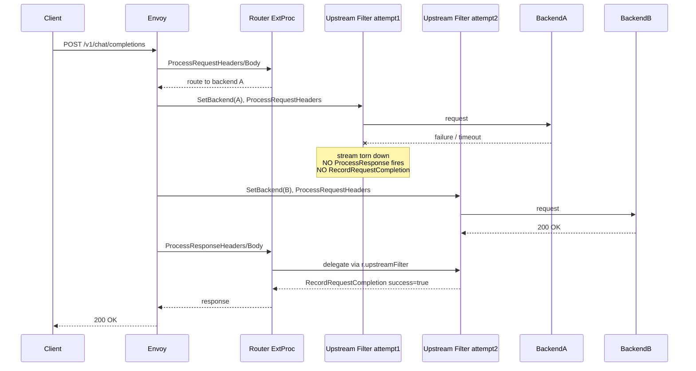

# Per-Attempt Failure Metrics for Retry and Fallback

## Proposal Summary

When Envoy AI Gateway (EAIG) retries a request — either via `AIGatewayRoute` priority-based fallback or via `BackendTrafficPolicy` retry — only the *terminal* attempt is recorded in the `gen_ai.server.request.duration` metric. Every intermediate failed attempt is silently dropped, which makes per-backend reliability invisible to operators and breaks fallback-rate dashboards.

This proposal extends the existing request-completion recording so that **every upstream attempt produces its own metric record**, with the failure attributed to the backend that actually failed. A request that took N attempts will surface as N records (typically N-1 retried-away failures plus one final success or failure), regardless of which retry mechanism caused the additional attempts.

Each retried-away failure is tagged with a new `error.type = "gateway_retry"` value and a `gen_ai.request.attempt_number` attribute, so operators can both fold these failures into per-backend error rates and exclude their partial latency from end-user latency percentiles.

**This document is about:**

- How successful and failed request metrics are recorded today
- Why intermediate retry/fallback failures are not visible
- A retry-agnostic proposal to record each attempt as its own metric, with the relevant per-attempt information attached

## Background

EAIG instruments the OpenTelemetry GenAI semantic-convention metric `gen_ai.server.request.duration` from the extproc **upstream filter**. The metric is recorded through `RecordRequestCompletion(ctx, success, headers)` in [internal/metrics/metrics_impl.go](internal/metrics/metrics_impl.go), which records the request latency histogram and, on failure, attaches `error.type`.

The reason intermediate attempts are lost is architectural. The upstream filter is configured with response processing disabled — in [internal/extensionserver/post_translate_modify.go](internal/extensionserver/post_translate_modify.go) (lines 307-315) the upstream ExtProc filter sets:

```
RequestHeaderMode:  SEND
RequestBodyMode:    NONE
ResponseHeaderMode: SKIP
ResponseBodyMode:   NONE
```

The comment in that file says it plainly: "Response will be handled at the router filter level so that we could avoid the shenanigans around the retry+the upstream filter." Response handling is therefore delegated: the router filter's `ProcessResponseHeaders` / `ProcessResponseBody` call into `r.upstreamFilter.ProcessResponse*` (see [internal/extproc/processor_impl.go](internal/extproc/processor_impl.go) line 167 onward), and `r.upstreamFilter` only ever points at the **latest** attempt because it is overwritten on every `SetBackend` (line 646).

Consequently, when Envoy abandons an attempt and retries, that attempt's upstream filter stream is torn down before any response-phase handler runs. The deferred `RecordRequestCompletion` in `ProcessResponseBody` never fires for it, and the failure is never counted.

The net effect is that the metric reflects only the outcome of the final attempt. From a Prometheus perspective the failing backend looks healthy because none of its failures were ever counted.

## Issue Statement

Operators rely on `gen_ai.server.request.duration` (and the `error.type` label on it) to monitor per-backend reliability and to compute fallback / recovery rates. Today:

- A request that fails on backend A and succeeds on backend B records only backend B's success. Backend A's failure is invisible.
- A request that retries the same backend twice and then succeeds records only the success. The intermediate failure is invisible.
- Per-backend error rate, mean time between failures, and fallback rate all under-report — sometimes by 100%.
- OTel/Prometheus consumers and SLO dashboards built on the duration metric silently over-state backend health, so alerting thresholds never trip even when a backend is failing the majority of first attempts.

This is the root cause of the gap reported when running EAIG in fallback mode or with `BackendTrafficPolicy.retry` enabled.

## Current Metrics Flow

Every `RecordRequestCompletion` call site lives in the upstream processor in [internal/extproc/processor_impl.go](internal/extproc/processor_impl.go):

- Line 323 — `ProcessRequestHeaders` deferred handler: records failure if request-header processing errors locally.
- Line 346 — `ProcessRequestHeaders`: records failure when the request body is rejected with a user-facing 422.
- Line 449 — `ProcessResponseHeaders` deferred handler: records failure if response-header processing errors locally.
- Lines 482 / 486 — `ProcessResponseBody` deferred handler: records failure on an error / bad upstream status (482) or success at end-of-stream (486). This is the normal terminal-outcome path.
- Line 618 — `SetBackend` deferred handler: records failure if backend setup (e.g. translator creation) errors locally.

The key observation is that all of these fire only when *this attempt's* upstream filter executes one of its own handlers. For an attempt that Envoy retries away from, none of the response-phase handlers (449, 482, 486) ever run, and the request-phase handlers (323, 346) only fire on local errors, not on upstream failures. So an upstream failure that triggers a retry produces no metric at all.

The lifecycle below shows a two-attempt request (backend A fails, backend B succeeds):



Only `Upstream2` records anything; `Upstream1`'s failure against backend A is invisible. The same holds for same-backend retries: only the surviving attempt is counted.

## Proposed Solution

Record every attempt's outcome on its own backend label so the request-duration metric reflects each upstream attempt exactly once. The mechanism reuses state that already lives on the router processor.

### Trigger point

At the moment a new upstream attempt begins, the previous attempt's processor is still reachable. In `SetBackend` ([internal/extproc/processor_impl.go](internal/extproc/processor_impl.go) line 615), `rp.upstreamFilterCount` is incremented at line 625 and `rp.upstreamFilter` is overwritten with the new attempt only at line 646. Between those two points, `rp.upstreamFilter` still references the previous attempt's `upstreamProcessor`, which holds its own `metrics.Metrics` instance with the backend / provider / model labels and `requestStart` timing already bound.

The proposal: at the start of `SetBackend`, if `rp.upstreamFilter != nil` (i.e. this is not the first attempt), record a failed completion on the *previous* attempt's metrics instance before the pointer is overwritten. This is retry-agnostic — it fires identically for `AIGatewayRoute` priority fallback and for `BackendTrafficPolicy` retry, because both ultimately drive a fresh `SetBackend` on a new upstream filter.

The existing `onRetry()` helper (line 310, `parent.upstreamFilterCount > 1`) already encodes the "this is a retry" condition and can be reused.

### Attributes attached to each per-attempt failure

The lightweight set, all of which are already available on the previous attempt's metrics instance or trivially derivable:

- All existing base attributes from `buildBaseAttributes` ([internal/metrics/metrics_impl.go](internal/metrics/metrics_impl.go)): `gen_ai.operation.name`, `gen_ai.provider.name`, `gen_ai.original.model`, `gen_ai.request.model`, plus any configured header-derived labels. These are already correctly bound to the failed attempt's backend.
- `error.type = "gateway_retry"` — a new constant distinct from the existing `_OTHER` ([internal/metrics/genai.go](internal/metrics/genai.go) line 58). Using a separate value lets operators (a) fold retried-away failures into total error rate and (b) exclude their partial latency from end-user latency percentiles. Terminal failures keep `_OTHER`.
- `gen_ai.request.attempt_number` — the ordinal of the failed attempt (1, 2, ...). Low cardinality in practice because retry/fallback counts are small and bounded by configuration.
- `gen_ai.response.model = "unknown"` — acceptable, since a retried-away attempt never produced a response model.

### Out of scope for this phase

Intentionally not captured here:

- The HTTP status code of the failed attempt.
- The upstream error body.
- The distinction between a transport failure (connect/timeout) and an HTTP retry-on-status (e.g. 429/503).

The reason is the same architectural constraint described in Background: the upstream filter's response phase is `SKIP` / `NONE`, so the failed attempt's upstream filter never observes the upstream status before being torn down. Capturing it requires changing the xDS ProcessingMode and is deferred to a future phase (see Options Considered).

## Observability Examples (PromQL)

With per-attempt failures recorded, operators can write meaningful queries against the existing duration counter.

Per-backend true error rate (terminal failures plus retried-away failures):

```promql
sum by (gen_ai_provider_name) (
  rate(gen_ai_server_request_duration_count{error_type=~"_OTHER|gateway_retry"}[5m])
)
```

End-user latency, unaffected by retry partials (exclude the partial-latency records so client-perceived percentiles stay accurate):

```promql
histogram_quantile(0.95,
  sum by (le) (
    rate(gen_ai_server_request_duration_bucket{error_type!="gateway_retry"}[5m])
  )
)
```

Fallback recovery rate — the ratio of retried-away failures to terminal successes per provider (how often a provider needed a retry to eventually succeed):

```promql
sum by (gen_ai_provider_name) (
  rate(gen_ai_server_request_duration_count{error_type="gateway_retry"}[5m])
)
/
sum by (gen_ai_provider_name) (
  rate(gen_ai_server_request_duration_count{error_type=""}[5m])
)
```

## Why Not a New Metric

An earlier draft introduced a dedicated `gen_ai.server.request.fallback` counter with `previous_backend` and `attempt_count` attributes. That approach works but adds API surface, new attributes, and parallel dashboards.

Recording per-attempt outcomes on the existing metric is simpler:

- No new metric and no scrape changes; only a new `error.type` value and one low-cardinality attribute.
- Per-backend error rate becomes accurate by construction.
- Fallback / recovery rate is derivable directly in PromQL from the existing counter, partitioned by `gen_ai.provider.name` and `error.type`.

## Implementation Notes

A follow-up PR would change the following (no code in this proposal):

- [internal/extproc/processor_impl.go](internal/extproc/processor_impl.go) — in `SetBackend`, add a per-attempt failure-recording branch that fires on the previous `rp.upstreamFilter` when present, plus a small `recordedAsRetry` guard field on `upstreamProcessor` to prevent double-counting if an attempt both reaches the response path and is then retried.
- [internal/metrics/genai.go](internal/metrics/genai.go) — add `genaiErrorTypeRetry = "gateway_retry"` and `genaiAttributeAttemptNumber = "gen_ai.request.attempt_number"` constants.
- [internal/metrics/metrics_impl.go](internal/metrics/metrics_impl.go) — extend the completion recording to accept an optional attempt number and an `error.type` override (or add a sibling method such as `RecordRetriedAttempt`) so existing callers are unaffected.
- [internal/extproc/mocks_test.go](internal/extproc/mocks_test.go) — extend `mockMetrics` to capture the new call for assertions.
- Add a focused unit test covering a two-attempt sequence: one `gateway_retry` failure record for backend A and one terminal record for backend B.

No changes are required to the controller or any CRD.

## Options Considered

- **Dedicated fallback metric (`gen_ai.server.request.fallback`).** Rejected as duplicative once the per-attempt recording is in place; the same signal is derivable from the existing counter.
- **Lean on `x-envoy-attempt-count`.** Rejected because the header is populated only for HTTP retries, not for priority-based fallback (which is the main EAIG use case), and even then it conveys only the count, not which backend failed.
- **Surface per-attempt failures only as logs.** Rejected because operators need metric-shaped data for dashboards and alerting; logs alone do not satisfy the requirement.
- **Phase 2: enrich with HTTP status code per attempt.** Deferred, not rejected. Flipping the upstream-filter `ResponseHeaderMode` from `SKIP` to `SEND` would let each attempt's upstream filter observe the upstream status before teardown, allowing a real per-attempt status/error label. This is a more invasive xDS/extproc change and is intentionally separated from the lightweight Phase 1 above.
