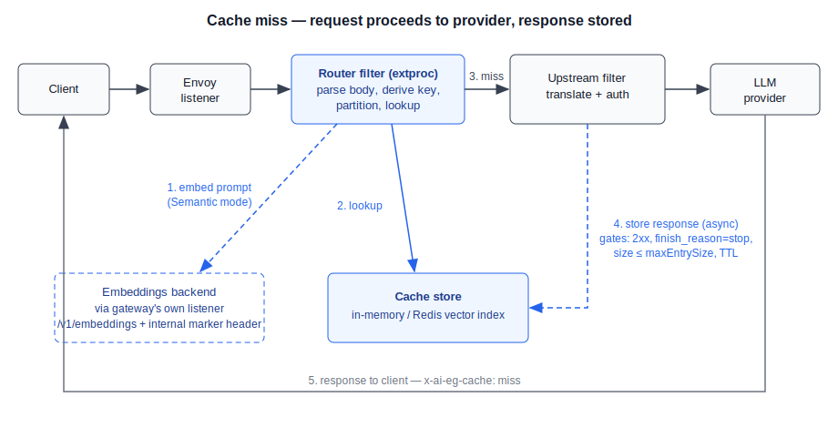
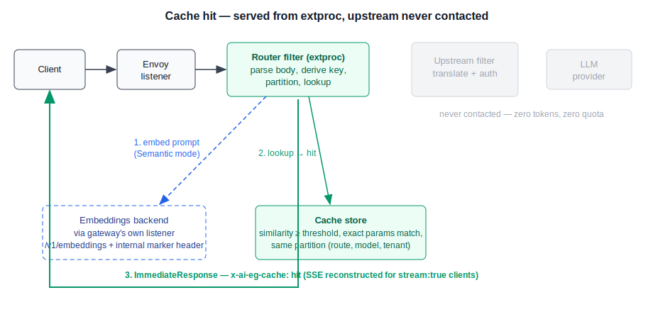

# Semantic Caching for LLM Responses

## Table of Contents

1. [Summary](#summary)
2. [Background and Motivation](#background-and-motivation)
   - 2.1 [Prior Art](#prior-art)
3. [Goals and Non-Goals](#goals-and-non-goals)
4. [Feature Definition](#feature-definition)
5. [Control Plane API](#control-plane-api)
   - 5.1 [AICachePolicy](#aicachepolicy)
   - 5.2 [Cache Storage Configuration](#cache-storage-configuration)
   - 5.3 [Controller Behavior](#controller-behavior)
6. [Data Plane Design](#data-plane-design)
   - 6.1 [Request Flow](#request-flow)
   - 6.2 [Cache Lookup and Hit Short-Circuit](#cache-lookup-and-hit-short-circuit)
   - 6.3 [Embedding Invocation](#embedding-invocation)
   - 6.4 [Cache Write](#cache-write)
   - 6.5 [Streaming](#streaming)
7. [Cache Key, Partitioning, and Safety](#cache-key-partitioning-and-safety)
   - 7.1 [Partitioning](#partitioning)
   - 7.2 [Request Field Handling](#request-field-handling)
   - 7.3 [HTTP Cache Semantics](#http-cache-semantics)
   - 7.4 [Write Gates](#write-gates)
   - 7.5 [Interaction with Token Quotas and Costs](#interaction-with-token-quotas-and-costs)
8. [Storage](#storage)
   - 8.1 [Store Interface](#store-interface)
   - 8.2 [In-Memory Store](#in-memory-store)
   - 8.3 [Redis Store](#redis-store)
9. [Observability](#observability)
10. [Alternatives Considered](#alternatives-considered)
11. [Security Considerations](#security-considerations)
12. [Implementation Phases](#implementation-phases)
13. [Open Questions](#open-questions)
14. [References](#references)

## Summary

This proposal adds response caching for OpenAI-compatible chat completion requests to Envoy AI
Gateway, with two matching modes: **exact** (byte-identical normalized requests) and **semantic**
(requests whose prompt content is similar above a configurable embedding-similarity threshold).
Caching is enabled per route through a new `AICachePolicy` resource, backed by a pluggable store
(in-memory for standalone/dev, Redis with vector search for production), and computes embeddings by
calling an embeddings model through the gateway's own data plane, so any provider already supported
by the `/v1/embeddings` translation pipeline can serve as the embedder.

A cache hit is served directly from the external processor without contacting any upstream LLM,
reducing p50 latency from seconds to milliseconds and eliminating the token cost of the request
entirely. This answers design issue #30.

## Background and Motivation

LLM inference is the most expensive and slowest hop in the request path. Many real workloads are
highly repetitive:

- RAG and support assistants receive near-duplicate questions ("how do I reset my password" /
  "password reset how") that produce equivalent answers.
- Agentic pipelines re-issue identical tool-selection or classification prompts across runs.
- Evaluation and CI workloads replay the same prompt sets continuously.

Exact-match HTTP caching fails on the first category because trivially different wording produces a
different cache key. Semantic caching addresses this by keying on the _meaning_ of the prompt: the
gateway embeds the prompt text, performs a nearest-neighbor search over previously stored entries,
and serves the stored response when similarity exceeds a configured threshold.

Cache hits are served in single-digit milliseconds and consume zero upstream tokens, so even modest
hit rates translate directly into provider-bill savings and latency wins. Semantic caching is a
headline feature of comparable gateways and one of the longest-standing open asks in this project
(issue #30, opened at project start).

### Prior Art

- **Issue #30** requests a design proposal for semantic caching covering motivation, feature
  definition, control plane API, and technical implementation — this document.
- **An early high-level design** was sketched by @Krishanx92 in issue #30 (vector-embedding based
  matching in front of the LLM). This proposal builds on the same core idea and carries it through
  to a concrete control-plane API and data-plane integration.
- **PR #1803** by @johnpanos implemented exact-match Redis response caching with an inline
  `responseCache` field on `AIGatewayRoute`, HTTP `Cache-Control` handling, and a hit/miss response
  header. It validated demand (the author ran it in production) but stalled without review. This
  proposal deliberately differs in three ways: matching is semantic-first (exact is the degenerate
  case), configuration is a separate policy resource rather than a field on `AIGatewayRoute`, and
  storage is pluggable rather than Redis-only. The `Cache-Control` semantics and hit/miss
  observability header from #1803 are retained in spirit.
- **Proposal 008 (Gemini context caching)** covers _provider-side prompt-prefix_ caching, where the
  provider bills cached input tokens at a discount. It is orthogonal: context caching reduces the
  cost of tokens that are still sent to the provider; response caching avoids sending the request at
  all. The two compose.
- **vLLM Semantic Router (issue #1415)** offers semantic caching as part of an external routing
  sidecar. Native gateway support keeps the feature available regardless of routing topology and
  reuses the gateway's existing provider translation and auth machinery for embeddings.

## Goals and Non-Goals

**Goals:**

- Exact and semantic response caching for `/v1/chat/completions`, enabled per route.
- Cache hits served without contacting any upstream, including for `stream: true` clients.
- Embedding computation through any `AIServiceBackend` (self-hosted TEI/NIM embedders or hosted
  providers), reusing the existing `/v1/embeddings` translation and auth pipeline.
- Pluggable storage: in-memory (standalone `aigw`, dev, tests) and Redis with vector search
  (production).
- Safe defaults: per-credential cache isolation, fail-open on storage or embedder errors,
  conservative write gates.
- OpenTelemetry metrics for hit/miss/bypass/error rates and lookup latency.

**Non-Goals:**

- In-process (local/ONNX) embedding models. The store and embedder interfaces leave room for this
  later.
- Endpoints other than chat completions in the initial scope (embeddings, images, audio,
  completions, MCP).
- Cross-replica coherence for the in-memory store; it is documented as single-replica.
- Encryption at rest inside the store; the store is treated as trusted infrastructure (see
  [Security Considerations](#security-considerations)).
- Provider-side prompt caching (see proposal 008) and automatic cache-point injection (issue #1679).
- A cache invalidation/administration API beyond TTL expiry (future enhancement).

## Feature Definition

For each request on a route with an attached `AICachePolicy`:

1. The gateway derives an **exact key** from the normalized request (see
   [Request Field Handling](#request-field-handling)) and a **partition** identifying the route,
   model, and tenant.
2. **Lookup.** In `Exact` mode, the store is queried by exact key. In `Semantic` mode, the prompt
   text is embedded and the store performs a nearest-neighbor search within the partition; a stored
   entry qualifies as a hit only if its similarity is at or above `similarityThreshold` **and** its
   non-content request parameters match exactly.
3. **Hit:** the stored response is returned immediately to the client with response header
   `x-ai-eg-cache: hit`. The upstream is never contacted; no tokens are consumed.
4. **Miss:** the request proceeds unchanged (`x-ai-eg-cache: miss`). If the final response satisfies
   the [write gates](#write-gates), it is stored with the policy's TTL.
5. **Bypass:** requests that are disqualified from caching (or when the policy/storage is in a
   failed state and `failureMode: Allow`) proceed unchanged with `x-ai-eg-cache: bypass`.

## Control Plane API

### AICachePolicy

A new namespaced resource following the policy-attachment pattern established by `QuotaPolicy`:

```yaml
apiVersion: aigateway.envoyproxy.io/v1alpha1
kind: AICachePolicy
metadata:
  name: chat-cache
  namespace: default
spec:
  # Attach to one or more AIGatewayRoutes in the same namespace.
  targetRefs:
    - group: aigateway.envoyproxy.io
      kind: AIGatewayRoute
      name: my-chat-route
  # Exact | Semantic
  mode: Semantic
  # Required. Capped by validation (e.g. 24h).
  ttl: 1h
  # Required when mode == Semantic.
  semantic:
    # Cosine similarity in [0, 1]; entries below this never hit.
    similarityThreshold: "0.95"
    embedding:
      # AIServiceBackend in the same namespace serving /v1/embeddings.
      backendRef:
        name: embeddings-backend
      model: text-embedding-3-small
      # Budget for the embedding round-trip; on expiry the request
      # bypasses the cache (failureMode: Allow) instead of waiting.
      timeout: 2s
  # Optional. Header values hashed into the cache partition. When unset,
  # the partition is derived from the request credential (Authorization /
  # api-key header), i.e. per-credential isolation. Set to [] to opt in
  # to a route-wide shared cache.
  keyHeaders:
    - x-user-id
  # Allow (default): on storage/embedder error, bypass the cache and
  # forward the request. Deny: fail the request with 503.
  failureMode: Allow
  # Responses larger than this are not stored.
  maxEntrySize: 1Mi
```

Rationale for a separate resource rather than a field on `AIGatewayRoute`:

- Caching is cross-cutting and optional, with enough configuration surface (mode, thresholds,
  embedder, partitioning, failure policy) to bloat the route API. `QuotaPolicy` set the precedent
  for this shape.
- A separate CRD can remain `v1alpha1` and iterate freely while the feature matures, without
  touching the `v1beta1` storage version of `AIGatewayRoute`.
- Policy attachment leaves room to later support `sectionName` targeting for per-rule scoping and
  additional target kinds without API breaks. The initial implementation supports route-level
  targeting only.

When multiple `AICachePolicy` resources target the same route, the oldest by creation timestamp
(name as tie-break) wins and the others are marked not-accepted in status, matching existing policy
conflict conventions.

### Cache Storage Configuration

The storage _connection_ is gateway-scoped, not per-policy: the external processor maintains one
store client per process. It is configured in `GatewayConfig` (which already carries gateway-level
defaults such as `GlobalLLMRequestCosts`):

```yaml
apiVersion: aigateway.envoyproxy.io/v1beta1
kind: GatewayConfig
metadata:
  name: my-gateway-config
spec:
  cacheStorage:
    # Redis | Memory
    type: Redis
    redis:
      address: redis.ai-gateway-system.svc.cluster.local:6379
      # Optional. Keys: username (optional), password.
      secretRef:
        name: redis-auth
      # Optional TLS to the Redis endpoint.
      tls:
        caCertificateRef:
          name: redis-ca
```

`type: Memory` requires no further configuration and is the default for the standalone `aigw` CLI.
An `AICachePolicy` attached to a gateway with no `cacheStorage` is marked `Accepted: False` in
status and ignored by the data plane.

### Controller Behavior

The controller:

1. Watches `AICachePolicy`, resolves `targetRefs` to `AIGatewayRoute`s, and validates that the
   embedding `backendRef` exists and that each attached gateway has `cacheStorage` configured.
2. Populates route-scoped cache entries in the `filterapi.Config` handed to the external processor,
   following the same route-name-scoped pattern as `LLMRequestCost`. Storage connection settings
   flow into the same config from `GatewayConfig`.
3. For `Semantic` policies, ensures the embedding backend is reachable from the gateway's own data
   plane by synthesizing an internal route rule matched on a reserved internal header (see
   [Embedding Invocation](#embedding-invocation)). The reserved header is stripped from external
   traffic at the listener, as with other `x-ai-eg-*` internal headers.
4. Maintains status conditions (`Accepted`, `ResolvedRefs`) on the policy.

Config updates propagate through the existing filter-config hot-reload watcher; no proxy restart is
required.

## Data Plane Design

### Request Flow





### Cache Lookup and Hit Short-Circuit

The lookup runs in the router-filter processor's `ProcessRequestBody`, immediately after the request
body is parsed and before backend selection. This is the single point where the full typed request
is available exactly once per request, regardless of retries or fallback backends.

On a hit, the processor returns an `ImmediateResponse` to Envoy carrying the stored response body
and headers — the same mechanism the `/v1/models` endpoint uses today — so the request never
reaches route selection, upstream auth, or any provider. On a miss or bypass, processing continues
unchanged; the only addition is the `x-ai-eg-cache` response header injected on the way out.

The cache is consulted only when the route has an attached, accepted policy; routes without a policy
take the existing code path with zero overhead.

### Embedding Invocation

In `Semantic` mode the processor must obtain an embedding of the prompt before lookup (on every
cacheable request) and before store (on write). Rather than embedding a bespoke HTTP client with its
own credentials and per-provider request formats into the processor, the processor sends a standard
OpenAI `/v1/embeddings` request to the gateway's **own listener**, marked with a reserved internal
header that the controller-synthesized rule matches and routes to the policy's embedding backend.

This buys, for free and with guaranteed consistency:

- provider translation for every embedding provider the gateway already supports (OpenAI, Azure,
  Bedrock, Vertex — and anything added later),
- `BackendSecurityPolicy`-managed upstream auth,
- GenAI metrics, tracing, and token-cost accounting on embedding traffic.

Recursion is impossible by construction: requests carrying the internal marker header skip cache
processing entirely, and the marker is stripped from external traffic.

The embedding round-trip is bounded by `semantic.embedding.timeout`. On timeout or error the request
bypasses the cache (`failureMode: Allow`) rather than queueing behind a slow embedder. This latency
tax — one embedding call ahead of every cacheable miss — is the fundamental trade-off of semantic
caching and is called out in [Open Questions](#open-questions); deployments that cannot afford it
use `mode: Exact`.

### Cache Write

Writes happen in the upstream-filter processor's `ProcessResponseBody` once the complete response is
available, after translation to the OpenAI schema. Entries always store the **canonical translated
OpenAI response JSON** plus usage metadata — never raw provider bytes — so a single entry can serve
clients of any provider behind the route and both streaming and non-streaming clients.

Writes are asynchronous with respect to the client response (fire-and-forget with error metrics);
a slow store never delays the response.

### Streaming

- **Hit, `stream: true` client:** the processor reconstructs an SSE stream (`chat.completion.chunk`
  events terminated by `[DONE]`) from the stored response object and returns it in a single
  immediate response with `content-type: text/event-stream`. Delivery is effectively instantaneous,
  so chunk pacing is irrelevant; clients observe a well-formed stream.
- **Miss, streamed upstream response:** the initial implementation does **not** populate the cache
  from streamed upstream responses, because the response-body phase currently processes chunks
  without accumulating the decoded stream. A later phase adds bounded accumulation (abandoning the
  write and marking the entry uncacheable the moment `maxEntrySize` is exceeded, and persisting only
  on a complete stream with a terminal `finish_reason` and usage). Until then, streamed requests
  read the cache but only non-streamed responses populate it. This asymmetry is deliberate and
  keeps memory behavior of the streaming path untouched in early phases.

## Cache Key, Partitioning, and Safety

### Partitioning

Every entry is stored and queried within a partition:

```
partition = (gateway, route name, original request model, tenant hash)
```

`tenant hash` is a SHA-256 over the values of the policy's `keyHeaders` if set, otherwise over the
request's credential header (`Authorization` / `api-key`). Semantic nearest-neighbor queries carry
the partition as mandatory filters, so a request can never be served a response cached under a
different route, model, or tenant — isolation is structural, not threshold-dependent.

The default (per-credential isolation) trades hit rate for safety. Sharing a cache across users is
an explicit opt-in via `keyHeaders` (e.g. a team header, or `[]` for route-wide sharing) and is
documented with a warning: anyone who can read a shared cache can observe responses generated for
other callers.

### Request Field Handling

| Request field                                                                                                             | Handling                                                                                                                                          |
| ------------------------------------------------------------------------------------------------------------------------- | ------------------------------------------------------------------------------------------------------------------------------------------------- |
| `messages` (text content)                                                                                                 | Semantic: embedded for similarity; also part of the exact key. Exact: part of the exact key.                                                      |
| `model`                                                                                                                   | Partition component (original model, before any override).                                                                                        |
| `tools`, `tool_choice`, `response_format`, `temperature`, `top_p`, `max_tokens` / `max_completion_tokens`, `seed`, `stop` | Exact-match metadata: part of the exact key; in semantic mode a candidate entry must match these exactly in addition to the similarity threshold. |
| `stream`, `stream_options`, `user`                                                                                        | Ignored (do not affect matching).                                                                                                                 |
| `n > 1`, `logprobs` / `top_logprobs`                                                                                      | Disqualify: request bypasses the cache.                                                                                                           |
| Non-text content parts (images, audio)                                                                                    | Disqualify in initial scope.                                                                                                                      |

Note that `temperature` does not disqualify caching: serving a stored response to a
high-temperature request is the nature of caching (the client asked for _a_ sample, and gets a
previously generated one). Deployments for which any reuse is unacceptable simply do not attach a
policy to the route. What the design guarantees is that parameter-_different_ requests (different
`temperature`, different `tools`, …) never match each other.

### HTTP Cache Semantics

- Request `Cache-Control: no-cache` → skip lookup, still eligible for store.
- Request `Cache-Control: no-store` → skip lookup and store.
- Response header `x-ai-eg-cache: hit | miss | bypass` is always set on cache-enabled routes.

### Write Gates

A response is stored only if **all** hold:

- status is 2xx,
- every choice's `finish_reason` is `stop` (not `length`, not `content_filter`, not tool calls in
  the initial scope),
- encoded size ≤ `maxEntrySize`,
- the request was not disqualified and did not carry `Cache-Control: no-store`.

### Interaction with Token Quotas and Costs

Cache hits never reach the upstream filter where token usage is extracted and request costs are
computed, so hits consume no tokens, emit no cost metadata, and burn no `QuotaPolicy` budget — the
desired behavior by construction. The stored usage object is returned in the replayed response body
for client-side visibility, and hits remain observable through the cache metrics and the
`x-ai-eg-cache` header.

## Storage

### Store Interface

A new internal package provides:

```go
// Partition scopes every operation; entries never match across partitions.
type Partition struct {
	Gateway string
	Route   string
	Model   string
	Tenant  string // hash, see Partitioning
}

type Entry struct {
	ResponseJSON []byte // canonical OpenAI chat completion response
	Usage        openai.Usage
	ExactParams  string // hash of exact-match metadata (tools, temperature, ...)
}

type Store interface {
	// Lookup returns the entry for exactKey, or — when embedding is non-nil —
	// the nearest entry within threshold whose ExactParams match.
	Lookup(ctx context.Context, p Partition, exactKey string, embedding []float32, threshold float64) (*Entry, bool, error)
	Put(ctx context.Context, p Partition, exactKey string, embedding []float32, e *Entry, ttl time.Duration) error
}
```

Both modes flow through the same interface; `Exact` mode passes a nil embedding.

### In-Memory Store

Per-partition maps with TTL and an LRU size bound; semantic lookup is brute-force cosine over the
partition's entries. Zero new dependencies; suitable for the standalone `aigw` CLI, development,
and tests. Explicitly documented as single-replica: with multiple extproc replicas each holds an
independent cache (correctness is unaffected — only hit rate suffers).

### Redis Store

The production backend, and the only new Go dependency in the feature (`go-redis`). Entries are
stored as hashes with native key TTL; a vector index (RediSearch, HNSW, cosine metric) over the
embedding field with the partition components as tag fields makes every KNN query
partition-filtered inside Redis itself. Works with Redis Stack / Redis 8+, and with Redis Cluster
via hash tags on the partition. Connection settings (address, auth secret, TLS) come from
`GatewayConfig.cacheStorage`.

## Observability

- New OTel metrics alongside the existing GenAI metrics:
  - `gen_ai.cache.lookups` (counter) with attribute `result = hit | miss | bypass | error`, plus
    the standard operation/model attributes.
  - `gen_ai.cache.lookup.duration` (histogram) covering key derivation, embedding call (semantic),
    and store query.
- `x-ai-eg-cache` response header for per-request visibility.
- Tracing: the lookup (and embedding sub-call) appear as spans on the existing request trace.
- The router-filter processor currently has no metrics handle (only the upstream processor does);
  the implementation threads the existing metrics factory into it.

## Alternatives Considered

**Inline `cache` field on `AIGatewayRoute` (the PR #1803 shape).** Simpler for small setups, but
grows the project's largest CRD, forces immediate `v1beta1` (storage version) surface for an
experimental feature, and cannot be scoped or conflicted like a policy. Rejected in favor of policy
attachment; the migration path from #1803's field is a one-object translation.

**Caching at the Envoy / Envoy Gateway layer.** Raised by maintainers on #1803: could a generic
HTTP cache serve this, so non-AI traffic benefits too? A generic cache filter keys on
method/URI/headers; it cannot derive keys from a parsed JSON body, cannot compare embeddings, and
cannot reconstruct SSE — the AI-awareness lives in the external processor that already parses every
request. However, this design creates the seam deliberately: the processor computes the exact cache
key regardless of mode and can export it as dynamic metadata / a request header
(`x-ai-eg-cache-key`), so a future Envoy-level exact-match cache could consume AI-aware keys without
the AI gateway storing anything. That export is a cheap optional deliverable of phase 2.

**Direct embedding calls from the processor (own HTTP client + credentials).** Avoids the loopback
hop but re-implements provider translation, auth, TLS, and retries inside the processor for every
embedding provider — duplicating the gateway inside itself. Rejected.

**In-process embedding (ONNX / linked model).** Removes the embedding round-trip entirely but adds
a native runtime, model distribution, and CPU load to the data-plane pod. Left as a future
`embedding.type` extension; the interfaces accommodate it.

**External semantic-cache sidecar (e.g. vLLM Semantic Router).** Viable today for its users, but
couples caching to a specific routing topology and duplicates provider auth. Native support serves
all routes uniformly; integration with SR remains possible at the routing layer (issue #1415).

## Security Considerations

- **Cross-tenant leakage** is the primary risk of any shared response cache. Mitigated structurally:
  partition filters (route, model, tenant hash) are mandatory in every store query, and the default
  tenant hash is per-credential. Similarity thresholds are never the isolation boundary.
- **Cache poisoning.** Only gateway-generated responses that pass the write gates are stored; there
  is no client-facing write path. An attacker with write access to Redis can poison responses, so
  the store must be treated as the same trust tier as the extproc itself: dedicated instance,
  AUTH/ACLs, TLS, network policy. At-rest encryption is out of scope.
- **PII.** Prompts (as embeddings + exact-key material) and full responses are stored in the
  configured store for up to `ttl`. Operators must apply their data-retention requirements when
  choosing TTLs and store deployment; documentation will state this explicitly.
- **Amplification.** Each cacheable request triggers at most one internal embedding request, and the
  internal marker header both bypasses cache processing for the embedding call (no recursion) and is
  stripped from external traffic (no client can invoke the internal route).
- **Failure behavior.** `failureMode: Allow` (default) degrades to bypass on store/embedder failure
  — availability over cost saving; error-rate metrics prevent silent degradation. `Deny` is
  available where serving uncached traffic is unacceptable (hard cost controls).

## Implementation Phases

Each phase is an independently reviewable PR; later phases depend on earlier ones.

| Phase | Scope                                                                                                                                                                                                                                                | Main areas                                                  |
| ----- | ---------------------------------------------------------------------------------------------------------------------------------------------------------------------------------------------------------------------------------------------------- | ----------------------------------------------------------- |
| 1     | `AICachePolicy` CRD (v1alpha1), `GatewayConfig.cacheStorage`, controller reconciliation, filter-config plumbing, CRD manifests                                                                                                                       | `api/`, `internal/controller/`, `internal/filterapi/`       |
| 2     | Store interface + in-memory store; exact mode end-to-end: key derivation, lookup + immediate-response hit (including SSE reconstruction for streaming clients), write path for non-streamed responses, safety gates, `x-ai-eg-cache` header, metrics | new cache package, `internal/extproc/`, `internal/metrics/` |
| 3     | Semantic mode: loopback embedding client, internal-rule synthesis, similarity lookup in the memory store                                                                                                                                             | `internal/extproc/`, `internal/controller/`                 |
| 4     | Redis store with vector index; secret/TLS wiring; e2e tests; examples                                                                                                                                                                                | new store implementation, `go.mod`, `examples/`, `tests/`   |
| 5     | Streamed-response cache writes (bounded accumulation)                                                                                                                                                                                                | `internal/extproc/`                                         |
| 6     | User-facing documentation, standalone `aigw` support notes                                                                                                                                                                                           | `site/`                                                     |

## Open Questions

1. **Miss-latency tax (semantic mode):** every cacheable request pays one embedding round-trip
   before routing. Is opt-in + per-policy timeout + `Exact` fallback sufficient, or should lookup
   and upstream dispatch race speculatively in a later iteration?
2. **Resource naming:** `AICachePolicy` vs folding into a broader future policy resource; and
   whether `sectionName` (per-rule) targeting should land in phase 1 or later (this proposal says
   later).
3. **Internal-rule synthesis** for the embedding loopback touches the extension-server config path;
   if it proves invasive, the fallback is requiring the embedding model to be routable on the same
   gateway, validated in policy status.
4. **Cached usage reporting:** should the replayed response body mark usage as cached (e.g. a
   `cached: true` extension field), or return the stored usage verbatim?
5. **ImmediateResponse size limits:** very large cached bodies are returned through the ext_proc
   immediate-response path; `maxEntrySize` bounds entry size, but Envoy-side limits should be
   validated early in phase 2.
6. **Relationship to PR #1803:** this proposal recommends superseding it once accepted, and invites
   its author to collaborate — the exact-mode phase covers that PR's use case on the new API.
7. **Default isolation:** per-credential isolation is the safe default but minimizes hit rate;
   maintainers may prefer a different default for `keyHeaders`.

## References

1. Issue #30 — [Design] Semantic Caching: https://github.com/envoyproxy/ai-gateway/issues/30
2. PR #1803 — feat: add redis response caching: https://github.com/envoyproxy/ai-gateway/pull/1803
3. Issue #1415 — Native integration with vLLM Semantic Router: https://github.com/envoyproxy/ai-gateway/issues/1415
4. Proposal 008 — Context Caching Support for GCP Vertex AI: ../008-gemini-context-caching/proposal.md
5. Issue #1679 — Support automatic cache point injection: https://github.com/envoyproxy/ai-gateway/issues/1679
