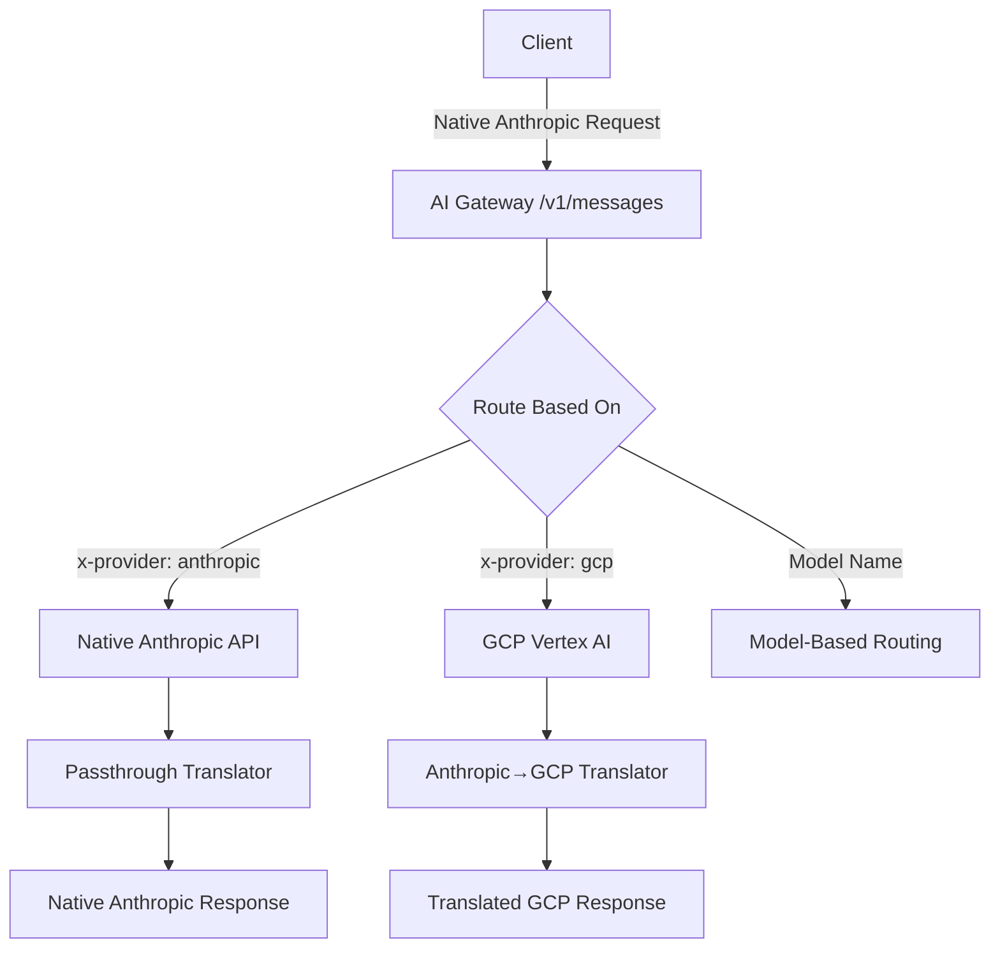

# Native Anthropic API Support

This directory contains examples demonstrating how to use the AI Gateway with native Anthropic API format instead of OpenAI format. This enables access to Anthropic-specific features and provides a native Anthropic experience.

## Overview

The AI Gateway now supports two API formats:

1. **OpenAI Format** (`/v1/chat/completions`) - Universal interface that translates to various providers
2. **Native Anthropic Format** (`/v1/messages`) - Direct Anthropic Messages API support

## Key Benefits of Native Anthropic Support

- **No Translation Overhead**: Direct passthrough to Anthropic API when routing to native Anthropic backend
- **Full Feature Access**: Access to all Anthropic-specific features (thinking, tools, citations, etc.)
- **Flexible Routing**: Route to different Anthropic backends (native API, GCP Vertex AI) from the same endpoint
- **Future-Proof**: Native support for new Anthropic features as they're released

## Quick Start

### 1. Apply the Configuration

```bash
kubectl apply -f native-messages.yaml
```

### 2. Update Secrets

Replace the placeholder values in the secrets with your actual credentials:

```bash
# For Anthropic API
kubectl patch secret anthropic-api-key -p '{"stringData":{"apiKey":"your-actual-anthropic-api-key"}}'

# For GCP Vertex AI (if using)
kubectl patch secret gcp-service-account-key -p '{"stringData":{"serviceAccountKey":"your-gcp-service-account-json"}}'
```

### 3. Test the Native Endpoint

```bash
# Basic request to native Anthropic API
curl -X POST localhost:8080/v1/messages \
  -H "Content-Type: application/json" \
  -H "x-provider: anthropic" \
  -d '{
    "model": "claude-3-5-sonnet-20241022",
    "max_tokens": 1024,
    "messages": [
      {
        "role": "user",
        "content": "Hello, Claude! How are you today?"
      }
    ]
  }'
```

## API Format

The native Anthropic endpoint (`/v1/messages`) accepts standard Anthropic Messages API requests:

```json
{
  "model": "claude-3-5-sonnet-20241022",
  "max_tokens": 1024,
  "messages": [
    {
      "role": "user",
      "content": "What is the capital of France?"
    }
  ],
  "system": "You are a helpful assistant.",
  "temperature": 0.7,
  "stream": false
}
```

### Supported Features

- **Text Messages**: Standard text-based conversations
- **Multimodal Input**: Images, documents, and other media types
- **Streaming**: Real-time response streaming with `"stream": true`
- **Tools**: Function calling and tool use
- **System Prompts**: Rich system message configuration
- **Advanced Parameters**: Temperature, top_p, top_k, stop sequences
- **Extended Thinking**: Claude's reasoning process when enabled
- **Citations**: Automatic source attribution for responses

## Routing Options

The configuration supports multiple routing strategies:

### 1. Provider-Based Routing

Use the `x-provider` header to select the backend:

```bash
# Route to native Anthropic API
curl -H "x-provider: anthropic" ...

# Route to GCP Vertex AI
curl -H "x-provider: gcp" ...

# Route to GCP Vertex AI
curl -H "x-provider: gcp" ...
```

### 2. Model-Based Routing

The gateway automatically extracts the model from the request and routes based on model names:

- `claude-3-5-sonnet-20241022` → Native Anthropic API

- Any other model → Fallback to native Anthropic API

### 3. Custom Header Routing

The model name is also available in the `x-ai-eg-model` header for custom routing rules.

## Backend Configurations

### Native Anthropic API

```yaml
apiVersion: aigateway.envoyproxy.io/v1alpha1
kind: AIServiceBackend
metadata:
  name: anthropic-native
spec:
  schema:
    name: Anthropic
    version: v1
  backendRef:
    name: anthropic-api
```


### GCP Vertex AI

```yaml
apiVersion: aigateway.envoyproxy.io/v1alpha1
kind: AIServiceBackend
metadata:
  name: anthropic-gcp-vertex
spec:
  schema:
    name: GCPAnthropic
  backendRef:
    name: gcp-vertex-ai
```

## Example Requests

### Basic Text Completion

```bash
curl -X POST http://localhost:8080/v1/messages \
  -H "Content-Type: application/json" \
  -d '{
    "model": "claude-3-5-sonnet-20241022",
    "max_tokens": 100,
    "messages": [
      {"role": "user", "content": "Write a haiku about AI."}
    ]
  }'
```

### Streaming Response

```bash
curl -X POST http://localhost:8080/v1/messages \
  -H "Content-Type: application/json" \
  -d '{
    "model": "claude-3-5-sonnet-20241022",
    "max_tokens": 100,
    "stream": true,
    "messages": [
      {"role": "user", "content": "Count from 1 to 10."}
    ]
  }'
```

### With System Prompt

```bash
curl -X POST http://localhost:8080/v1/messages \
  -H "Content-Type: application/json" \
  -d '{
    "model": "claude-3-5-sonnet-20241022",
    "max_tokens": 200,
    "system": "You are a poetic assistant. Respond only in rhyme.",
    "messages": [
      {"role": "user", "content": "Tell me about the ocean."}
    ]
  }'
```

### Multimodal with Images

```bash
curl -X POST http://localhost:8080/v1/messages \
  -H "Content-Type: application/json" \
  -d '{
    "model": "claude-3-5-sonnet-20241022",
    "max_tokens": 300,
    "messages": [
      {
        "role": "user",
        "content": [
          {
            "type": "text",
            "text": "What do you see in this image?"
          },
          {
            "type": "image",
            "source": {
              "type": "base64",
              "media_type": "image/jpeg",
              "data": "/9j/4AAQSkZJRgABAQAAAQABAAD..."
            }
          }
        ]
      }
    ]
  }'
```

### Tool Use

```bash
curl -X POST http://localhost:8080/v1/messages \
  -H "Content-Type: application/json" \
  -d '{
    "model": "claude-3-5-sonnet-20241022",
    "max_tokens": 300,
    "tools": [
      {
        "name": "get_weather",
        "description": "Get current weather for a location",
        "input_schema": {
          "type": "object",
          "properties": {
            "location": {"type": "string", "description": "City name"}
          },
          "required": ["location"]
        }
      }
    ],
    "messages": [
      {"role": "user", "content": "What's the weather like in San Francisco?"}
    ]
  }'
```

## Migration from OpenAI Format

If you're currently using the OpenAI format (`/v1/chat/completions`), here's how to migrate:

### Request Format Changes

**OpenAI Format:**
```json
{
  "model": "claude-3-5-sonnet-20241022",
  "messages": [{"role": "user", "content": "Hello"}],
  "max_tokens": 100
}
```

**Native Anthropic Format:**
```json
{
  "model": "claude-3-5-sonnet-20241022",
  "messages": [{"role": "user", "content": "Hello"}],
  "max_tokens": 100
}
```

### Key Differences

1. **Endpoint**: `/v1/chat/completions` → `/v1/messages`
2. **Schema**: `OpenAI` → `Anthropic` in AIGatewayRoute
3. **Parameters**: Native Anthropic parameters are supported
4. **Response Format**: Native Anthropic response format
5. **Features**: Access to Anthropic-specific features

### Configuration Changes

Update your AIGatewayRoute:

```yaml
# Old OpenAI-based configuration
apiVersion: aigateway.envoyproxy.io/v1alpha1
kind: AIGatewayRoute
spec:
  schema:
    name: OpenAI

# New Anthropic-based configuration
apiVersion: aigateway.envoyproxy.io/v1alpha1
kind: AIGatewayRoute
spec:
  schema:
    name: Anthropic
```

## Architecture



## Troubleshooting

### Common Issues

1. **Invalid API Schema**: Ensure your AIGatewayRoute uses `schema.name: Anthropic`
2. **Authentication Errors**: Verify your API keys and secrets are correctly configured
3. **Model Not Found**: Check that the model name matches what's available in your backend
4. **Routing Issues**: Verify your routing rules match your request headers

### Debug Tips

1. **Check Pod Logs**: `kubectl logs -l app=ai-gateway-extproc`
2. **Verify Configuration**: `kubectl get aigatewayroute -o yaml`
3. **Test Connectivity**: Ensure backends are reachable from the cluster
4. **Validate Secrets**: Check that secrets contain the correct credentials

## Advanced Configuration

### Rate Limiting

```yaml
llmRequestCosts:
  - metadataKey: anthropic_input_tokens
    type: InputToken
  - metadataKey: anthropic_output_tokens
    type: OutputToken
```

### Custom Timeouts

```yaml
rules:
  - timeouts:
      request: 300s  # 5 minutes for long-running requests
    backendRefs:
      - name: anthropic-native
```

### Load Balancing

```yaml
backendRefs:
  - name: anthropic-native
    weight: 70
  - name: anthropic-gcp-vertex
    weight: 30
```

## Support

For questions and issues:

1. Check the [AI Gateway documentation](https://github.com/envoyproxy/ai-gateway)
2. Review the [Anthropic API documentation](https://docs.anthropic.com/en/api/messages)
3. Open an issue on the [AI Gateway repository](https://github.com/envoyproxy/ai-gateway/issues)

## Contributing

We welcome contributions! Areas for improvement:

- Additional backend translators (Anthropic→GCP)
- Enhanced examples and documentation
- Performance optimizations
- Test coverage
