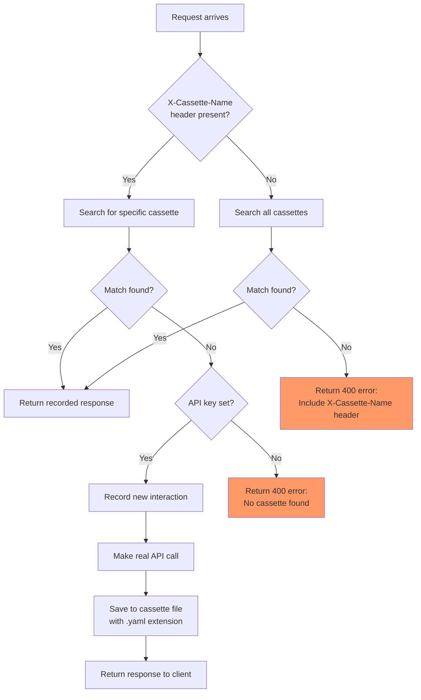

# Fake OpenAI Test Server

This package provides a fake OpenAI API server for testing AI Gateway functionality
without requiring actual API access or credentials.

Pre-recorded OpenAI request/responses are stored as YAML files in the
[cassettes](cassettes) directory, using the go-vcr v4 format.

## Overview

The fake server works by:

1. Automatically loading all pre-recorded API interactions from embedded "cassette" YAML files
2. Matching incoming requests against recorded interactions based on the `X-Cassette-Name` header
3. Replaying the recorded responses

This approach provides:

- **Deterministic testing**: Same inputs always produce same outputs
- **No API credentials needed**: Tests can run without OpenAI API keys
- **Fast execution**: No network calls to external services
- **Cost savings**: No API usage charges during testing

## Usage

### Basic Usage

```go
import (
	"testing"
	"github.com/envoyproxy/ai-gateway/internal/fakeopenai"
)

func TestMyFeature(t *testing.T) {
	// Create server on random port - cassettes are automatically loaded
	server, err := fakeopenai.NewServer()
	require.NoError(t, err)
	defer server.Close()

	// Create a request for a specific cassette
	req, err := fakeopenai.NewRequest(server.URL(), fakeopenai.CassetteChatBasic)
	require.NoError(t, err)

	// Make the request
	resp, err := http.DefaultClient.Do(req)
	// ... test your code
}
```

## Recording New Cassettes

The fake server can record new interactions when:

- No matching cassette is found
- `OPENAI_API_KEY` is set in the environment
- A cassette name is provided via `X-Cassette-Name` header

To record a new cassette, follow these steps:

1. **Add a constant** for your test scenario to [requests.go](requests.go):

   ```go
   const (
   	// ... existing constants
   	// CassetteChatFeatureX includes feature X, added to OpenAI version 1.2.3.
   	CassetteChatFeatureX = "chat-feature-x"
   )
   ```

2. **Add the request body** for your test to [requests.go](requests.go):

   ```go
   var requestBodies = map[string]string{
   	// ... existing entries
   	CassetteChatFeatureX: `{
         "model": "gpt-4.1-nano",
         "messages": [{"role": "user", "content": "Your test prompt"}],
         // Add your feature-specific fields here
       }`,
   }
   ```

3. **Add your new cassette to the test matrix** in [requests_test.go](requests_test.go):

   ```go
   // ... existing tests
   {
       cassetteName:   CassetteChatFeatureX,
       expectedStatus: http.StatusOK,
   },
   ```

4. **Run `TestNewRequest`** with your OpenAI API key set:

   ```bash
   cd internal/fakeopenai
   OPENAI_API_KEY=sk-.. go test -run TestNewRequest -v
   ```

5. **Commit both the new cassette file and code changes**

## Flowchart of Request Handling


