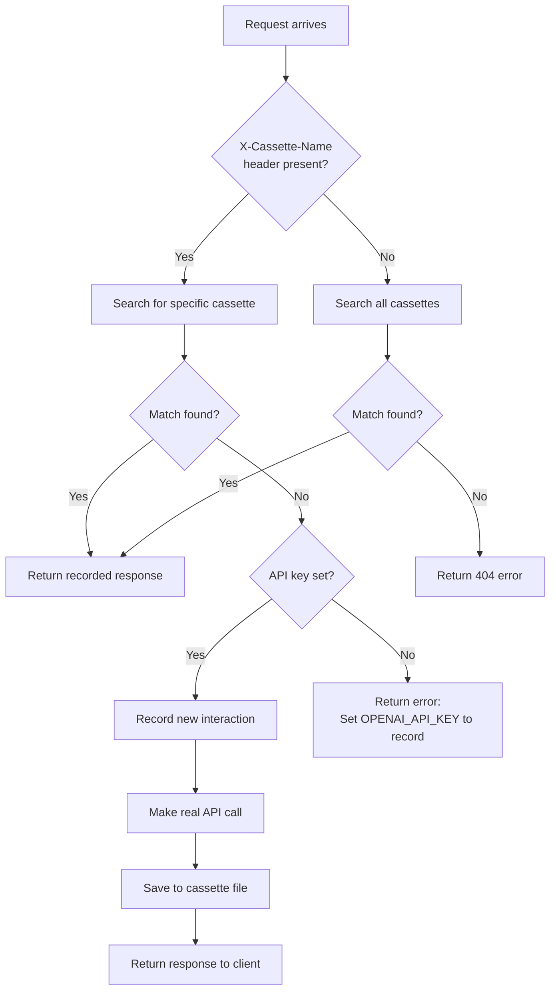

# Fake OpenAI Test Server

This package provides a fake OpenAI API server for testing AI Gateway functionality
without requiring actual API access or credentials.

Pre-recorded OpenAI request/responses are stored as YAML files in the
[cassettes](cassettes) directory, using the go-vcr v2 format.

## Overview

The fake server works by:
1. Automatically loading all pre-recorded API interactions from embedded "cassette" YAML files
2. Matching incoming requests against recorded interactions based on the `X-Cassette-Name` header
3. Replaying the recorded responses

This approach provides:
- **Deterministic testing**: Same inputs always produce same outputs
- **No API credentials needed**: Tests can run without OpenAI API keys
- **Fast execution**: No network calls to external services
- **Cost savings**: No API usage charges during testing

## Usage

### Basic Usage

```go
import (
    "testing"
    "github.com/envoyproxy/ai-gateway/internal/testing/fakeopenai"
)

func TestMyFeature(t *testing.T) {
    // Create server on random port - cassettes are automatically loaded
    server, err := fakeopenai.NewServer()
    require.NoError(t, err)
    defer server.Close()

    // Create a request for a specific cassette
    req, err := fakeopenai.NewRequest(server.URL(), fakeopenai.CassetteChatBasic)
    require.NoError(t, err)

    // Make the request
    resp, err := http.DefaultClient.Do(req)
    // ... test your code
}
```

## Recording New Cassettes

The fake server can record new interactions when:
* No matching cassette is found
* `OPENAI_API_KEY` is set in the environment
* A cassette name is provided via `X-Cassette-Name` header

We simplify this [requests_test.go](requests_test.go). To record a new cassatted,
add one to the matrix like this::

1. **Add your new cassette to the test matrix**:
   ```go
   // In requests_test.go TestNewRequest
   {
       cassetteName:   "chat-my-new-feature",
       expectedStatus: http.StatusOK,
       description:    "Chat completion with my new feature",
   },
   ```

2. **Set your OpenAI API key** (or use a compatible backend):
   ```bash
   export OPENAI_API_KEY=sk-...
   # Optional: use a different backend like Ollama
   # export OPENAI_BASE_URL=http://localhost:11434/v1
   ```

3. **Run the test to record**:
   ```bash
   cd internal/testing/fakeopenai
   go test -run TestNewRequest -v
   ```

4. **The new cassette will be created** in `cassettes/chat-my-new-feature.yaml`

5. **Add the constant** to `requests.go`:
   ```go
   const (
       // ... existing constants
       CassetteChatMyNewFeature = "chat-my-new-feature"
   )
   ```

6. **Commit both the cassette file and code changes**

## Flowchart of Request Handling



