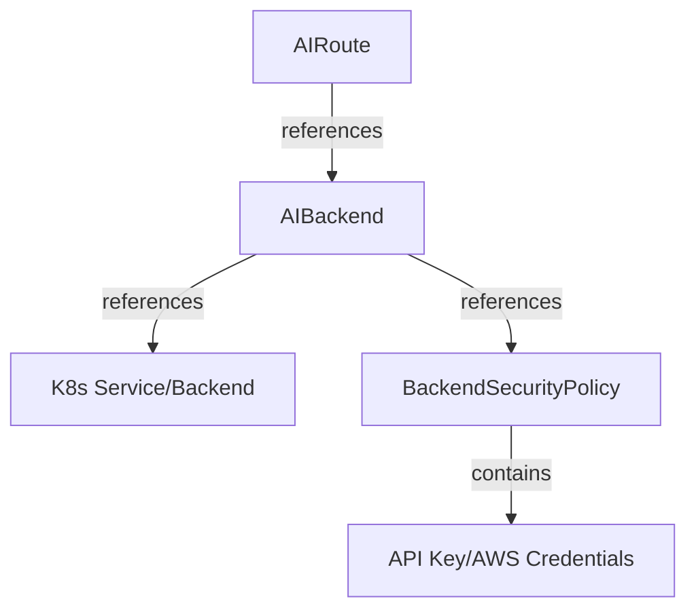

# Resources

The Envoy AI Gateway uses several custom resources to manage AI traffic. Here's an overview of the key resources and how they relate to each other:

## Resource Reference

| Resource | Purpose | API Reference |
|----------|---------|---------------|
| AIRoute | Defines unified API and routing rules for AI traffic | [AIRoute](../api/api.mdx#AIRoute) |
| AIBackend | Represents individual AI service backends | [AIBackend](../api/api.mdx#AIBackend) |
| BackendSecurityPolicy | Configures authentication for backend access | [BackendSecurityPolicy](../api/api.mdx#backendsecuritypolicy) |

## Core Resources

### AIRoute

A resource that defines a unified AI API for a Gateway, allowing clients to interact with multiple AI backends using a single schema.
- Specifies the input API schema for client requests
- Contains routing rules to direct traffic to appropriate backends
- Manages request/response transformations between different API schemas
- Can track LLM request costs (like token usage)

### AIBackend

Represents a single AI service backend that handles traffic with a specific API schema.

- Defines the output API schema the backend expects
- References a Kubernetes Service or Envoy Gateway Backend
- Can reference a BackendSecurityPolicy for authentication

### BackendSecurityPolicy

Configures authentication and authorization rules for backend access.

- API Key authentication
- AWS credentials authentication

## Resource Relationships

The AIRoute acts as the entry point, defining how client requests are processed and routed to one or more AIBackends. Each AIBackend can reference a BackendSecurityPolicy, which provides the necessary credentials for accessing the underlying AI service.
